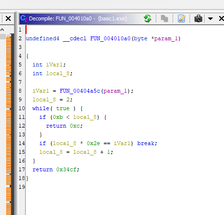
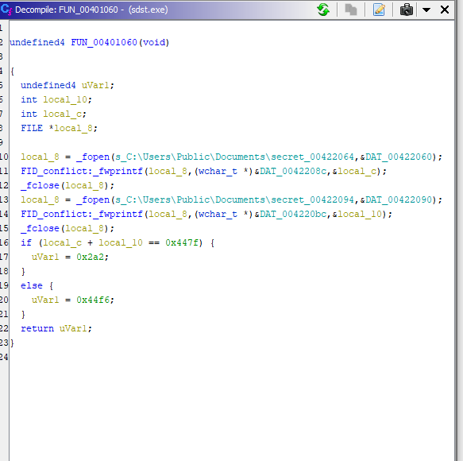

```c
# Basic Algorithm

Understand the loop here to find the flag. It loops until local_8 = 11 (Since loop will break at 12)
  2,  3,   4,   5,   6,   7,   8,   9,  10,  11
 92, 138, 184, 230, 276, 322, 368, 414, 460, 506
    
 
    
```



```
Software Doing Software Things
Main function is below, that creates the success criteria. 

Notice how the program is writing two files to a directory. It's addubg the two values (local_c and local_10 to 0x447f). If they match, you'll recieve success. 
```

