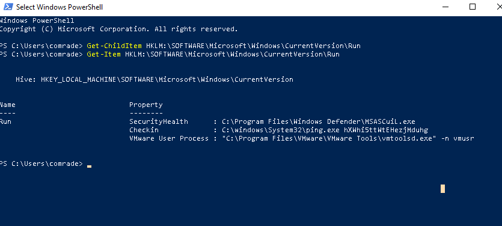

```bash
192.168.150.253 - Intranet
192.168.28.9/27 - Internal
192.168.28.100 - Extranet

comrade::StudentMidwayPassword

C:\Windows\System32\01NUCLEAR01
xfreerdp /u:comrade /p:StudentMidwayPassword /v:localhost:7777 /dynamic-resolution

```



```bash
#Tunnels
ssh -i /tmp/.ssh/id_rsa comrade@localhost -p 3333 -L 7777:192.168.28.9:3389 -NT

ssh 10.50.15.8 -L 2222:192.168.28.100:2222 -NT

ssh www-data@localhost -p 2222 -L 4444:192.168.150.253:3201 -NT

#Dynamic 
ssh -i /tmp/.ssh/id_rsa comrade@localhost -p 4444 -D 9050 -NT
```

