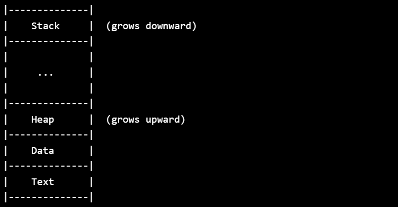
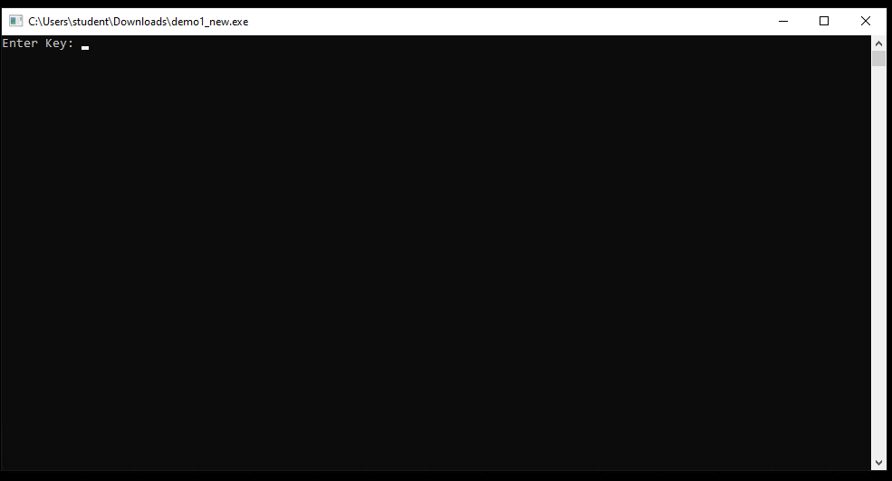
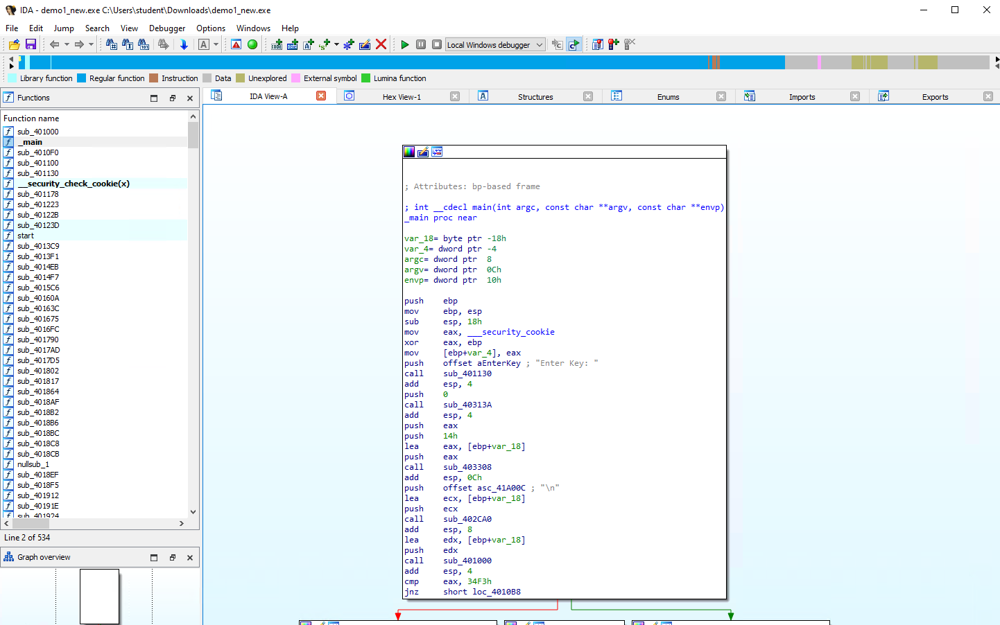
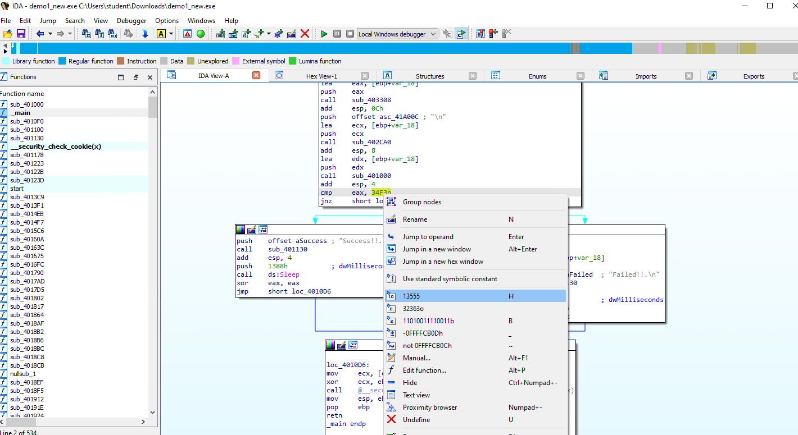
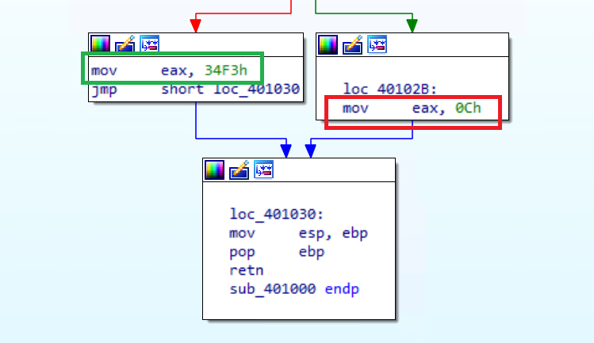
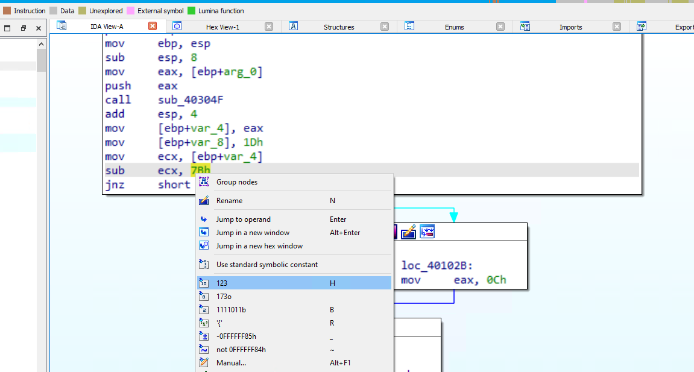

# Day 4/5 - Reverse Engineering

[TOC]

## X86_64 (Intel) Assembly - Common Terms

- Heap - Memory that can be allocated and deallocated
- Stack - A contiguous section of memory used for passing arguments
- General Register - A multipurpose register that can be used by either programmer or user to store data or a memory location address
- Control Register - A processor register that changes or controls the behavoir of a CPU
- Flags Register - Contains the current state of the processor

## Stack



- Last in, first out - This principle dictates that the last element added to the stack is the first one to be removed. In other words, the most recently added element is always at the top, and any operations on the stack will affect this top element. 

## General Purpose Registers

- %rax - the first return register
- %rbp - the base pointer that keeps track of the base stack
- %rsp - the stack pointer that points to the top of the stack

## Common Instruction Pointers

- MOV - move source to destination 
- PUSH - push source onto stack
- POP - pop top of stack to destination 
- INC - increment source by 1
- DEC - decrement source by 1
- ADD - add source to destination 
- SUB - subtract source from destination 
- CMP - Compare 2 values by subtracting them and setting the %RFLAGS register. ZeroFlag set means they are the same. 
- JMP - Jump to specified location
- JLE - Jump is less than or equal
- JE - Jump if equal

## Flags Register

- CF - Carry Flag - Generates a carry or borrow
- ZF - Zero Flag - Set by most instructions if the result of an operation is binary zero
- SF - Sign Flag - Set this bit the same as the most significant bit of the result. 0 = positive, 1 = negative
- OF - Overflow Flag - Set if the result was too large to fit in the designation.

## Assembly Example Code

```assembly
main:
    mov rax, 16     //16 moved into rax
    push rax        //push value of rax (16) onto stack. RSP is pushed up 8 bytes (64 bits)
    jmp mem2        //jmp to mem2 memory location

mem1:
    mov rax, 0      //move 0 (error free) exit code to rax
    ret             //return out of code

mem2:
    pop r8          //pop value on the stack (16) into r8. RSP falls 8 bytes
    cmp rax, r8     //compare rax register value (16) to r8 register value (16)
    je mem1         //jump if comparison has zero bit set to mem1
    mov rax, 1      //1 moved into rax
    ret             //return out of code

main:
    mov r10, 25     //store the value 25 in r10 register
    mov r11, 62     //store the value 62 in r11 register
    jmp mem1        //jumps to mem1 location
    mov rax, 1      //store 1 in rax   
    ret             //return out of code. If for some reason the jmp does not work, it will return 1

mem1:
    sub r11, 40     //subtract 40 from r11
    mov r12, r11    //copy r11 value to r12
    cmp r10, r12    //compare the values in r10 and r12
    jmple mem2      //jumps to mem2 location if value is less than or equal
    mov rax, 2      //store 2 in rax   
    ret             //return out of code. If for some reason the jmp does not work, it will return 2

mem2:
    mov rax, 0      //store 0 in rax
    ret             //return out of code. If everything executes properly, it will return 0
```


## Registry Practice

```html
https://slatinsky.github.io/x86sim/index.html
```


## C Source Code

```c

// Compile with gcc in Linux
// Compatible with 32 and 64bit ELF and PE files

// TLDR: This program takes a character string from stdin, converts it into an integer, then calls a functions that adds 66 to it and writes it to the screen.

#include <stdio.h>

int math(char* num1){
    int sumOf;
    int num2 = 66;
    int num11 = atoi(num1); //Converts the string into an integer
    sumOf = num11+num2;
    return sumOf;
}
int main(void){
    char num1[10];
    printf("Enter number: ");
    fgets(num1,5,stdin);
    strtok(num1, "\n");
    printf("%d\n",math(num1)); //Adds 66 to whatever the user inputs and then writes it to the screen
    return 0;
}
```

```c
// Compiled in gcc on Ubuntu 4.15.0-76-generic
// Compatible with 32 and 64bit ELF and PE files
// TLDR: This program takes an integerand adds 37 to it. If the program is given 1300 on stddin, then it output "We want this", else "It feels good in here".

#include <stdio.h>           /*STD I/O library, must be included to print result to screen*/
int main()                                      /*program entry*/
{                                               /*start of the instructions for the program*/

    int temp;                                 /*indicates the "temp" number can be a floating-point number*/
    int temp2;
    printf("What is the temperature inside?\n");  /*prints the text to the screen*/
    scanf("%i",&temp);                          //Reads stdin to the ptr for the temp variable
    temp2 = temp + 37;              //Adds 37 to whatever the user puts in standard input
    if(temp2 = 1337)                               /*checks the value of temp against a given value*/
    {
        printf("We want this!\n");      /*prints the associated text to the screen if value is met*/
    }
    else
    {
        printf("It feels good in here.\n");     /*prints associated text to the screen*/
    }
    return(0);
}
```

## Demo

Executable used:

```
demo1_new.exe
```



Open in IDA:



Upon some analysis, we see there is a success string for this program. Looking a little bit above, we see the cmp or compare instruction pointer which is the condition for our success criteria. EAX is what is being compared. 



Now we look up a little more to see the last function used prior to the compare condition. 


In this function, we see that two different values are being moved into EAX. 



34F3h matches what we found earlier that is being compared, so we know this part of the function is what is creating the success. 

The sub - ecx, 7Bh is the value required by the function for success. 123


