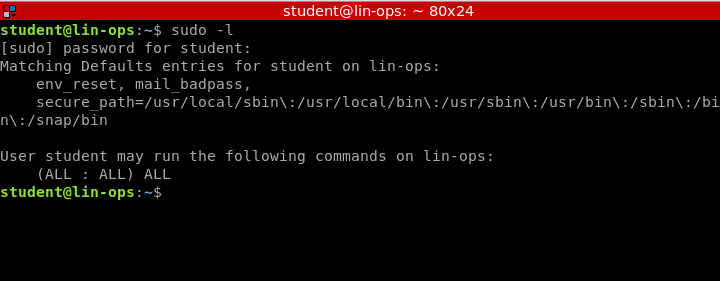
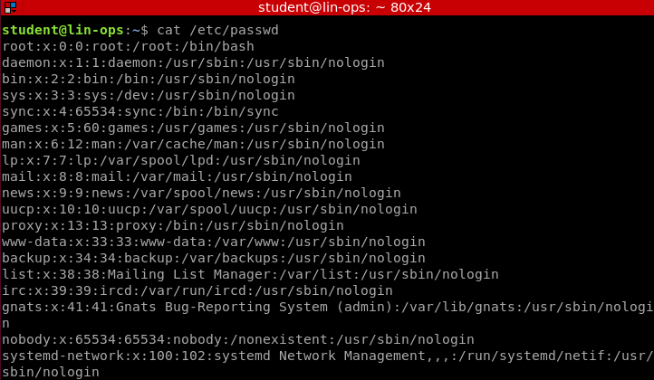
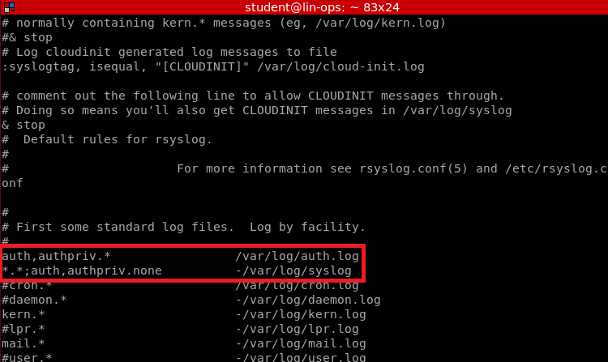

# Day 7 - Post Exploitation

## Internal Enumeration

### Basic Enumeration

Some steps that we take when we're on a box to privledge escalate. 

Check sudo -l

```bash
sudo -l
```



This will display what commands this user can run as sudo (temporary root)

Check /etc/passwd

```bash
cat /etc/passwd
```



Shows user information. Some more important items are the users with shells. /usr/sbin/nologin at the end means there's no shell. /bin/bash means there is a shell, in this case. 

Check /etc/shadow for any stored hashed passwords

```bash
sudo cat /etc/shadow
```


In this case, we see a hash for the student account. 

- *$1$* is Message Digest 5 (MD5)
- *$2a$* is *blowfish*
- *$5$* is 256-bit Secure Hash Algorithm (SHA-256)
- *$6$* is 512-bit Secure Hash Algorithm (SHA-512)
- *$y$* (or *$7$*) is *yescrypt*

More 'normal' commands can be run to find more information:

```bash
# Domain tied hosts
cat /etc/hosts

# System Information
uname -a

# Current status of system
w

# Current processes
ps -elf  # Kernel processes are in brackets
```

### Logging Check

Check to see if we're getting system logs

```
ps -elf | grep syslog
```

Then check, 

```bash
cat /etc/rsyslog.d/*
```

rsyslog.d will contain configuration files for WHAT are you are logging. 



Notice how auth, authpriv is uncommented. This means we're collecting these logs. 

### crontabs

Always check files in your crontabs

```bash
/var/spool/cron/crontabs/

cat /etc/crontab

sudo crontab -u *username* -l # Look at another users crontab
```

### Additional checks

Check for anything juicy. 

```
/home/
/etc/
/tmp/
```


## Private Key Hijacking

If we're able to steal a private key, we can use it ourselves in order to ssh as that user from the private key:

1. Find the private key on the victim

```bash
find ~/.ssh -name 'id_rsa' 2>/dev/null
# It could also be a different file name than 'id_rsa' 
```

2. Download to your /tmp/ directory. 

```bash
scp username@1.2.3.4:/path/to/key/private_key_name /tmp/
```

3. Change permissions and SSH into victim using their username

```bash
chmod 600 /tmp/private_key_name
ssh -i /tmp/private_key_name jane@1.2.3.4
```


## Beacon Identification

```bash
tcpdump -X -A not port ## <-- your ssh connection port
```

