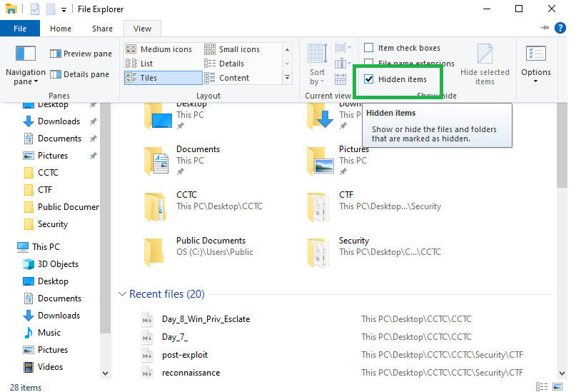
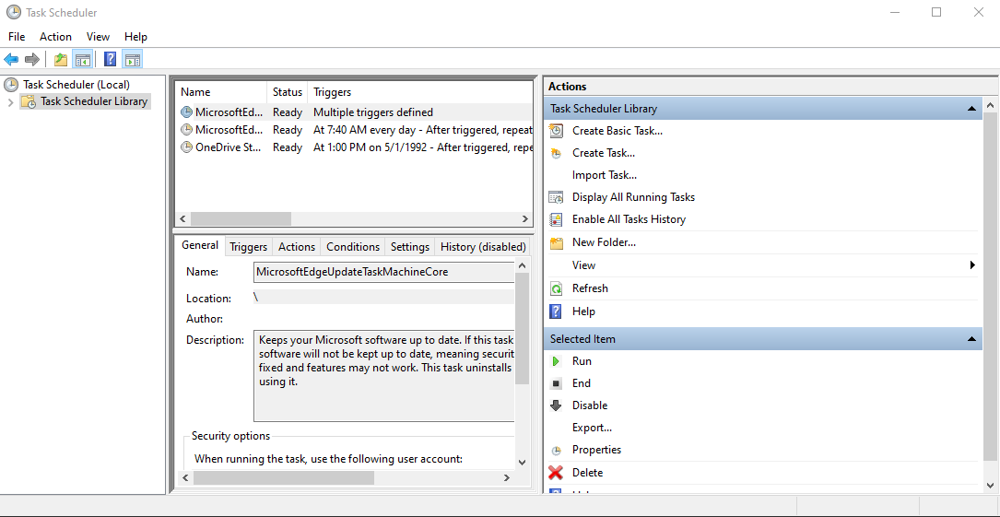
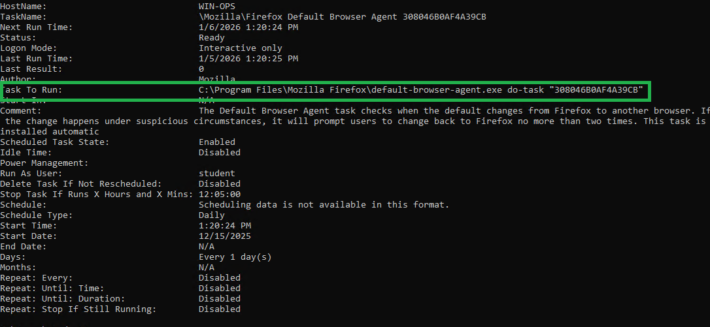
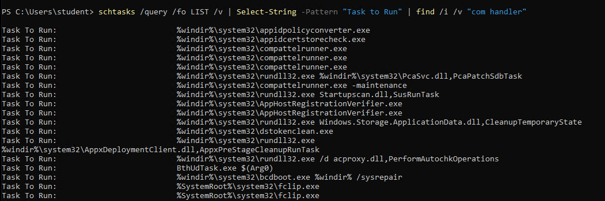
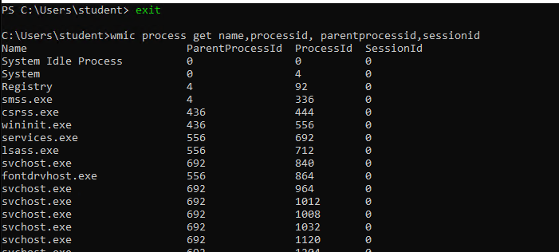
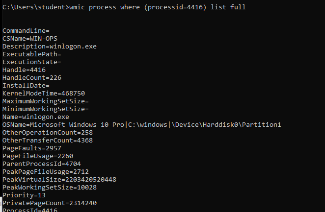

# Day 8 - Windows Privledge Esclation

[TOC]

## DLL Search Order

DLLs allow other programs to run functions from a certain executable - as to not 're-create the wheel'

Executables will check the following locations

```
HKEY_LOCAL_MACHINE\SYSTEM\CurrentControlSet\Control\Session Manager\KnownDLLs
```


## Searching for Windows Privildege Escalation

### Hidden Files

Search for hidden files, via file explorer



### Task Scheduler

In the search bar, search 'task scheduler'



Can also do in command line:

```
schtasks /query /fo LIST /v
```



Look for 'Task to Run'

Search for 'Task to Run' specifically in PowerShell:

```powershell
schtasks /query /fo LIST /v | Select-String -Pattern "Task to Run" | find /i /v "com handler"
```



**Newest scheduled tasks are at the top!**

Look for items that are not in system32. We are looking for third party programs. 

Once we identify the process that's running that is suspicious, we can run:

```cmd
wmic process get name,processid, parentprocessid,sessionid
```



Grab the PID and PPID

Research into the process more with the PID:

```
wmic process where (processid=4416) list full
```



Nothing too good here, lets try the PPID:

```cmd
wmic process where (processid=436) list full

See if associated with svchost.exe

tasklist /svc | findstr /i "1768"

# show where putty is! (Putty is the known odd executable)
where /R c:\ putty 


icacls c:\Users\student\exercise_2 (This is where putty was located)
Look for permissions on the file. (F) is good! Full permissions. 

```

## Check Services

All services that are legitiment have a description. Malicious services can sometimes NOT have a description. 

```
services.msc #In windows search bar
```


## Important Microsoft Event IDs

- 4624/4625 - Successful/failed login
- 4720 - Account created
- 4672 - Administrative user logged on
- 7045 - Service created

## 

